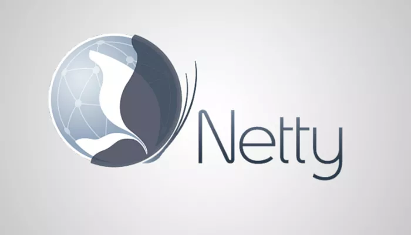
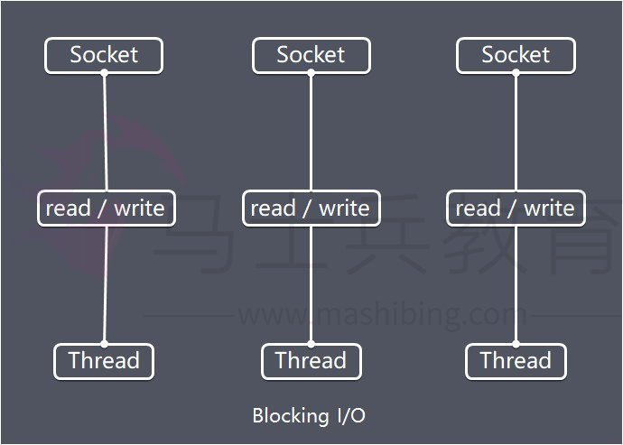
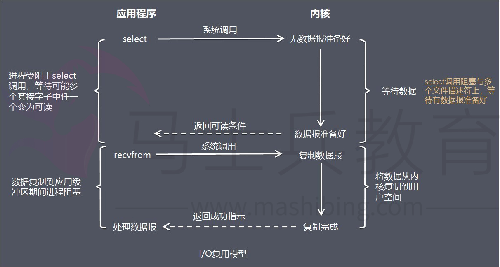
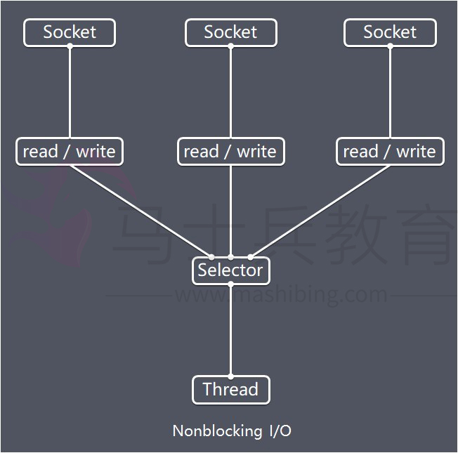
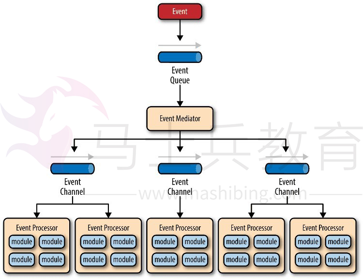
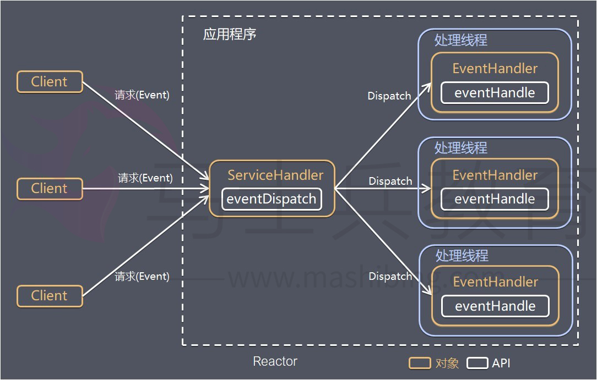
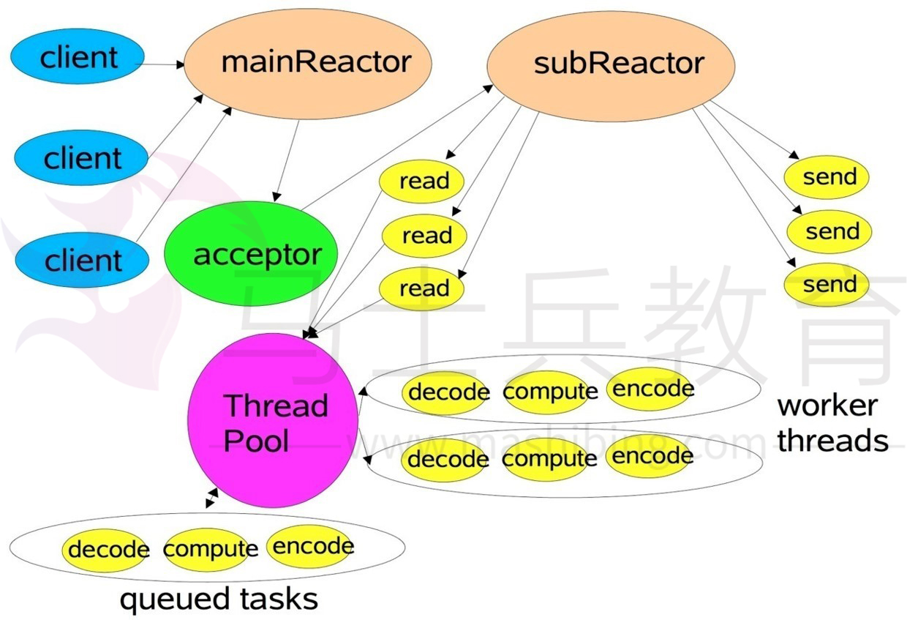
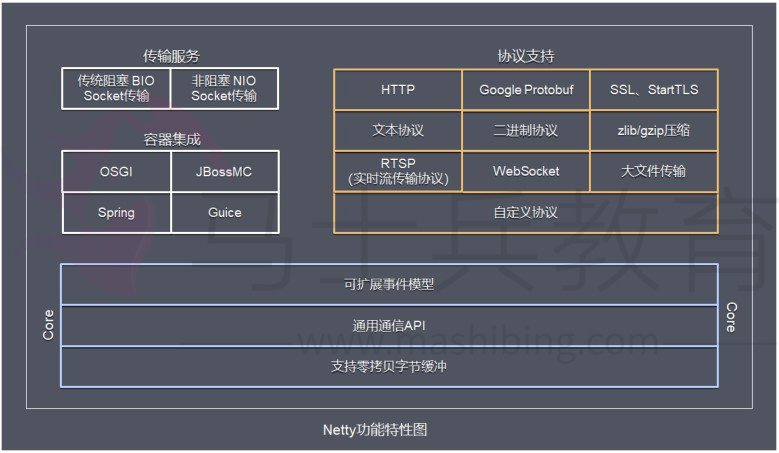
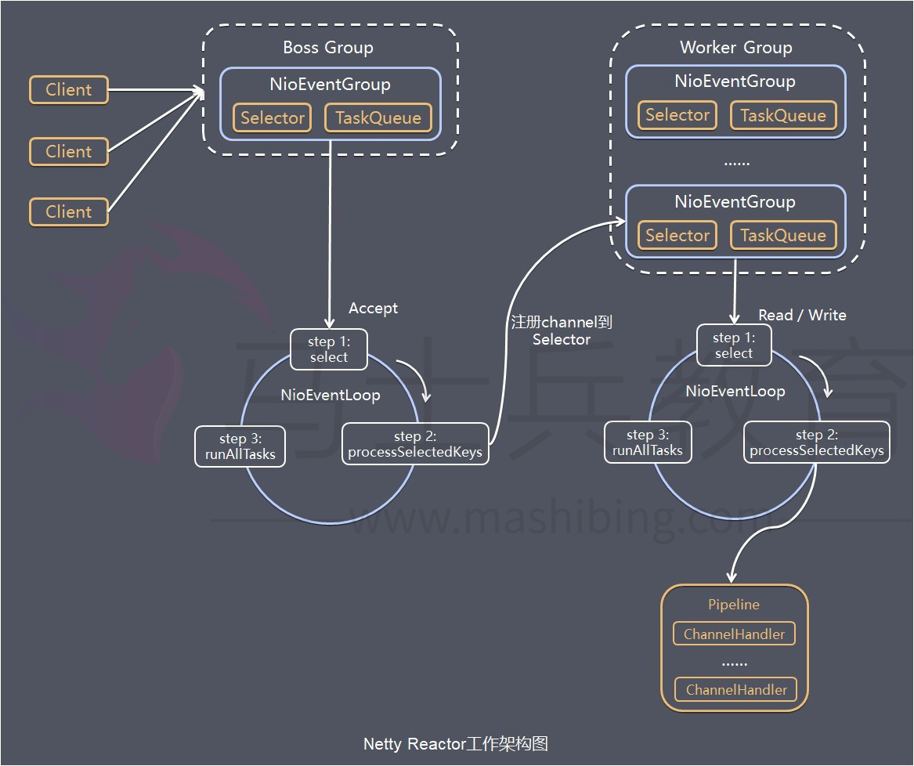

## 1. Netty 是什么？ 

Netty是 一个异步事件驱动的网络应用程序框架，用于快速开发可维护的高性能 协议服务器和客户端。Netty是基于nio的，它封装了jdk的nio，让我们使用起 来更加方法灵活。 

## 2. Netty 特点是什么？ 

- 高并发：Netty 是一款基于 NIO（Nonblocking IO，非阻塞IO）开发的网络通 信框架，对比于 BIO（Blocking I/O，阻塞IO），他的并发性能得到了很大提高。 
- 传输快：Netty 的传输依赖于零拷贝特性，尽量减少不必要的内存拷贝，实现了 更高效率的传输。 
- 封装好：Netty 封装了 NIO 操作的很多细节，提供了易于使用调用接口。 

## 3. Netty 的优势有哪些？ 

- 使用简单：封装了 NIO 的很多细节，使用更简单。 
- 功能强大：预置了多种编解码功能，支持多种主流协议。 
- 定制能力强：可以通过 ChannelHandler 对通信框架进行灵活地扩展。 
- 性能高：通过与其他业界主流的 NIO 框架对比，Netty 的综合性能优。 
- 稳定：Netty 修复了已经发现的所有 NIO 的 bug，让开发人员可以专注于业务 本身。 
- 社区活跃：Netty 是活跃的开源项目，版本迭代周期短，bug 修复速度快。 

## 4. Netty 的应用场景有哪些？ 

典型的应用有：阿里分布式服务框架 Dubbo，默认使用 Netty 作为基础通信组 件，还有 RocketMQ 也是使用 Netty 作为通讯的基础。 

## 5. Netty 高性能表现在哪些方面？ 

- IO 线程模型：同步非阻塞，用少的资源做更多的事。 
- 内存零拷贝：尽量减少不必要的内存拷贝，实现了更高效率的传输。 
- 内存池设计：申请的内存可以重用，主要指直接内存。内部实现是用一颗二叉查 找树管理内存分配情况。 
- 串形化处理读写：避免使用锁带来的性能开销。
- 高性能序列化协议：支持 protobuf 等高性能序列化协议。 

## 6. BIO、NIO和AIO的区别？

BIO：一个连接一个线程，客户端有连接请求时服务器端就需要启动一个线程进 行处理。线程开销大。 

伪异步IO：将请求连接放入线程池，一对多，但线程还是很宝贵的资源。 

NIO：一个请求一个线程，但客户端发送的连接请求都会注册到多路复用器上， 多路复用器轮询到连接有I/O请求时才启动一个线程进行处理。 

AIO：一个有效请求一个线程，客户端的I/O请求都是由OS先完成了再通知服务 器应用去启动线程进行处理， 

BIO是面向流的方式处理数据，NIO是面向缓冲区的(块的方式处理数据)；BIO的各种流是阻塞的。而NIO是非阻塞的；BIO的Stream是单向的，而NIO的channel是双向的。 

NIO的特点：事件驱动模型、单线程处理多任务、非阻塞I/O，I/O读写不再阻 塞，而是返回0、基于block的传输比基于流的传输更高效、更高级的IO函数 zero-copy、IO多路复用大大提高了Java网络应用的可伸缩性和实用性。基于 Reactor线程模型。 

在Reactor模式中，事件分发器等待某个事件或者可应用或个操作的状态发生， 事件分发器就把这个事件传给事先注册的事件处理函数或者回调函数，由后者来 做实际的读写操作。如在Reactor中实现读：注册读就绪事件和相应的事件处理 器、事件分发器等待事件、事件到来，激活分发器，分发器调用事件对应的处理 器、事件处理器完成实际的读操作，处理读到的数据，注册新的事件，然后返还 控制权。 

## 7. NIO的组成？ 

Buffer：与Channel进行交互，数据是从Channel读入缓冲区，从缓冲区写入 Channel中的 

flip方法 ： 反转此缓冲区，将position给limit，然后将position置为0，其实就 是切换读写模式 

clear方法 ：清除此缓冲区，将position置为0，把capacity的值给limit。 

rewind方法 ： 重绕此缓冲区，将position置为0 

DirectByteBuffer可减少一次系统空间到用户空间的拷贝。但Buffer创建和销毁 的成本更高，不可控，通常会用内存池来提高性能。直接缓冲区主要分配给那些易受基础系统的本机I/O 操作影响的大型、持久的缓冲区。如果数据量比较小的 中小应用情况下，可以考虑使用heapBuffer，由JVM进行管理。 

Channel：表示 IO 源与目标打开的连接，是双向的，但不能直接访问数据，只 能与Buffer 进行交互。通过源码可知，FileChannel的read方法和write方法都 导致数据复制了两次！ 

Selector可使一个单独的线程管理多个Channel，open方法可创建Selector， register方法向多路复用器器注册通道，可以监听的事件类型：读、写、连接、 accept。注册事件后会产生一个SelectionKey：它表示SelectableChannel 和 Selector 之间的注册关系，wakeup方法：使尚未返回的第一个选择操作立即返 回，唤醒的 

原因是：注册了新的channel或者事件；channel关闭，取消注册；优先级更高 的事件触发（如定时器事件），希望及时处理。 

Selector在Linux的实现类是EPollSelectorImpl，委托给EPollArrayWrapper实 现，其中三个native方法是对epoll的封装，而EPollSelectorImpl.  

implRegister方法，通过调用epoll_ctl向epoll实例中注册事件，还将注册的文 件描述符(fd)与SelectionKey的对应关系添加到fdToKey中，这个map维护了文 件描述符与SelectionKey的映射。 

fdToKey有时会变得非常大，因为注册到Selector上的Channel非常多（百万连 接）；过期或失效的Channel没有及时关闭。fdToKey总是串行读取的，而读取 是在select方法中进行的，该方法是非线程安全的。 

Pipe：两个线程之间的单向数据连接，数据会被写到sink通道，从source通道 读取 

NIO的服务端建立过程：Selector.open()：打开一个Selector； 

ServerSocketChannel.open()：创建服务端的Channel；bind()：绑定到某个 端口上。并配置非阻塞模式；register()：注册Channel和关注的事件到 Selector上；select()轮询拿到已经就绪的事件 

## 8. Netty的线程模型？ 

Netty通过Reactor模型基于多路复用器接收并处理用户请求，内部实现了两个 线程池，boss线程池和work线程池，其中boss线程池的线程负责处理请求的 accept事件，当接收到accept事件的请求时，把对应的socket封装到一个NioSocketChannel中，并交给work线程池，其中work线程池负责请求的read 和write事件，由对应的Handler处理。 

单线程模型：所有I/O操作都由一个线程完成，即多路复用、事件分发和处理都 是在一个Reactor线程上完成的。既要接收客户端的连接请求,向服务端发起连 接，又要发送/读取请求或应答/响应消息。一个NIO 线程同时处理成百上千的 链路，性能上无法支撑，速度慢，若线程进入死循环，整个程序不可用，对于高 负载、大并发的应用场景不合适。 

多线程模型：有一个NIO 线程（Acceptor） 只负责监听服务端，接收客户端的 TCP 连接请求；NIO 线程池负责网络IO 的操作，即消息的读取、解码、编码和 发送；1 个NIO 线程可以同时处理N 条链路，但是1 个链路只对应1 个NIO 线 程，这是为了防止发生并发操作问题。但在并发百万客户端连接或需要安全认证 时，一个Acceptor 线程可能会存在性能不足问题。 

主从多线程模型：Acceptor 线程用于绑定监听端口，接收客户端连接，将 SocketChannel 从主线程池的Reactor 线程的多路复用器上移除，重新注册到 Sub 线程池的线程上，用于处理I/O 的读写等操作，从而保证mainReactor只负 责接入认证、握手等操作； 

## 9. TCP 粘包/拆包的原因及解决方法？ 

TCP是以流的方式来处理数据，一个完整的包可能会被TCP拆分成多个包进行发 送，也可能把小的封装成一个大的数据包发送。 

TCP粘包/分包的原因： 

应用程序写入的字节大小大于套接字发送缓冲区的大小，会发生拆包现象，而应 用程序写入数据小于套接字缓冲区大小，网卡将应用多次写入的数据发送到网络 上，这将会发生粘包现象； 

进行MSS大小的TCP分段，当TCP报文长度-TCP头部长度>MSS的时候将发生拆 包 

以太网帧的payload（净荷）大于MTU（1500字节）进行ip分片。 

解决方法 

消息定长：FixedLengthFrameDecoder类 

包尾增加特殊字符分割： 

- 行分隔符类：LineBasedFrameDecoder
- 或自定义分隔符类 ：DelimiterBasedFrameDecoder 

将消息分为消息头和消息体：LengthFieldBasedFrameDecoder类。分为有头 部的拆包与粘包、长度字段在前且有头部的拆包与粘包、多扩展头部的拆包与粘 包。 

## 10. 什么是 Netty 的零拷贝？ 

Netty 的零拷贝主要包含三个方面： 

- Netty 的接收和发送 ByteBuffer 采用 DIRECT BUFFERS，使用堆外直接内存进 行 Socket 读写，不需要进行字节缓冲区的二次拷贝。如果使用传统的堆内存 （HEAP BUFFERS）进行 Socket 读写，JVM 会将堆内存 Buffer 拷贝一份到直接内 存中，然后才写入 Socket 中。相比于堆外直接内存，消息在发送过程中多了一次缓 冲区的内存拷贝。 
- Netty 提供了组合 Buffer 对象，可以聚合多个 ByteBuffer 对象，用户可以像操 作一个 Buffer 那样方便的对组合 Buffer 进行操作，避免了传统通过内存拷贝的方式 将几个小 Buffer 合并成一个大的 Buffer。 
- Netty 的文件传输采用了 transferTo 方法，它可以直接将文件缓冲区的数据发 送到目标 Channel，避免了传统通过循环 write 方式导致的内存拷贝问题。 

# 11.Netty 中有哪种重要组件？

-  Channel：Netty 网络操作抽象类，它除了包括基本的 I/O 操作，如 bind、 connect、read、write 等。
-  EventLoop：主要是配合 Channel 处理 I/O 操作，用来处理连接的生命周期中所发生的事情。
-  ChannelFuture：Netty 框架中所有的 I/O 操作都为异步的，因此我们需要 
- ChannelFuture 的 addListener()注册一个 ChannelFutureListener 监听事件，当操作执行成功或者失败时，监听就会自动触发返回结果。
-  ChannelHandler：充当了所有处理入站和出站数据的逻辑容器。
-  ChannelHandler 主要用来处理各种事件，这里的事件很广泛，比如可以是连接、数据接收、异常、数据转换等。
-  ChannelPipeline：为 ChannelHandler 链提供了容器，当 channel 创建时，就会被自动分配到它专属的 ChannelPipeline，这个关联是永久性的。

# 12.Netty 发送消息有几种方式？

Netty 有两种发送消息的方式：

- 直接写入 Channel 中，消息从 ChannelPipeline 当中尾部开始移动；
- 写入和 ChannelHandler 绑定的 ChannelHandlerContext 中，消息从ChannelPipeline 中的下一个 ChannelHandler 中移动。

# 13.默认情况 Netty 起多少线程？何时启动？

Netty 默认是 CPU 处理器数的两倍，bind 完之后启动。

# 14.了解哪几种序列化协议？

序列化（编码）是将对象序列化为二进制形式（字节数组），主要用于网络传输、数据持久化等；而反序列化（解码）则是将从网络、磁盘等读取的字节数组还原成原始对象，主要用于网络传输对象的解码，以便完成远程调用。

影响序列化性能的关键因素：序列化后的码流大小（网络带宽的占用）、序列化的性能（CPU资源占用）；是否支持跨语言（异构系统的对接和开发语言切换）。

Java默认提供的序列化：无法跨语言、序列化后的码流太大、序列化的性能差 XML，优点：人机可读性好，可指定元素或特性的名称。缺点：序列化数据只包含数据本身以及类的结构，不包括类型标识和程序集信息；只能序列化公共属性和字段；不能序列化方法；文件庞大，文件格式复杂，传输占带宽。适用场景：当做配置文件存储数据，实时数据转换。

JSON，是一种轻量级的数据交换格式，优点：兼容性高、数据格式比较简单，易于读写、序列化后数据较小，可扩展性好，兼容性好、与XML相比，其协议比较简单，解析速度比较快。缺点：数据的描述性比XML差、不适合性能要求为ms级别的情况、额外空间开销比较大。适用场景（可替代ＸＭＬ）：跨防火墙访问、可调式性要求高、基于Web browser的Ajax请求、传输数据量相对小，实时性要求相对低（例如秒级别）的服务。

Fastjson，采用一种“假定有序快速匹配”的算法。优点：接口简单易用、目前 java语言中  快的json库。缺点：过于注重快，而偏离了“标准”及功能性、代码质量不高，文档不全。适用场景：协议交互、Web输出、Android客户端

Thrift，不仅是序列化协议，还是一个RPC框架。优点：序列化后的体积小, 速度快、支持多种语言和丰富的数据类型、对于数据字段的增删具有较强的兼容性、支持二进制压缩编码。缺点：使用者较少、跨防火墙访问时，不安全、不具有可读性，调试代码时相对困难、不能与其他传输层协议共同使用（例如HTTP）、无法支持向持久层直接读写数据，即不适合做数据持久化序列化协议。适用场景：分布式系统的RPC解决方案

Avro，Hadoop的一个子项目，解决了JSON的冗长和没有IDL的问题。优点：支持丰富的数据类型、简单的动态语言结合功能、具有自我描述属性、提高了数据解析速度、快速可压缩的二进制数据形式、可以实现远程过程调用RPC、支持跨编程语言实现。缺点：对于习惯于静态类型语言的用户不直观。适用场景：在

Hadoop中做Hive、Pig和MapReduce的持久化数据格式。

Protobuf，将数据结构以.proto文件进行描述，通过代码生成工具可以生成对应数据结构的POJO对象和Protobuf相关的方法和属性。优点：序列化后码流小，性能高、结构化数据存储格式（XML JSON等）、通过标识字段的顺序，可以实现协议的前向兼容、结构化的文档更容易管理和维护。缺点：需要依赖于工具生成代码、支持的语言相对较少，官方只支持Java 、C++ 、python。适用场景：对性能要求高的RPC调用、具有良好的跨防火墙的访问属性、适合应用层对象的持久化

其它

protostuff 基于protobuf协议，但不需要配置proto文件，直接导包即可

Jboss marshaling 可以直接序列化java类， 无须实java.io.Serializable接口

Message pack 一个高效的二进制序列化格式

Hessian 采用二进制协议的轻量级remoting onhttp工具

kryo 基于protobuf协议，只支持java语言,需要注册（Registration），然后序列化（Output），反序列化（Input）

# 15.如何选择序列化协议？

具体场景

对于公司间的系统调用，如果性能要求在100ms以上的服务，基于XML的SOAP 协议是一个值得考虑的方案。

基于Web browser的Ajax，以及Mobile app与服务端之间的通讯，JSON协议是首选。对于性能要求不太高，或者以动态类型语言为主，或者传输数据载荷很小的的运用场景，JSON也是非常不错的选择。

对于调试环境比较恶劣的场景，采用JSON或XML能够极大的提高调试效率，降低系统开发成本。当对性能和简洁性有极高要求的场景，Protobuf，Thrift，Avro之间具有一定的竞争关系。

对于T级别的数据的持久化应用场景，Protobuf和Avro是首要选择。如果持久化后的数据存储在hadoop子项目里，Avro会是更好的选择。

对于持久层非Hadoop项目，以静态类型语言为主的应用场景，Protobuf会更符合静态类型语言工程师的开发习惯。由于Avro的设计理念偏向于动态类型语言，对于动态语言为主的应用场景，Avro是更好的选择。

如果需要提供一个完整的RPC解决方案，Thrift是一个好的选择。

如果序列化之后需要支持不同的传输层协议，或者需要跨防火墙访问的高性能场景，Protobuf可以优先考虑。

protobuf的数据类型有多种：bool、double、float、int32、int64、string、 bytes、enum、message。protobuf的限定符：required: 必须赋值，不能为

空、optional:字段可以赋值，也可以不赋值、repeated: 该字段可以重复任意次数（包括0次）、枚举；只能用指定的常量集中的一个值作为其值；

protobuf的基本规则：每个消息中必须至少留有一个required类型的字段、包含0个或多个optional类型的字段；repeated表示的字段可以包含0个或多个数据；[1,15]之内的标识号在编码的时候会占用一个字节（常用），[16,2047]之内的标识号则占用2个字节，标识号一定不能重复、使用消息类型，也可以将消息嵌套任意多层，可用嵌套消息类型来代替组。

protobuf的消息升级原则：不要更改任何已有的字段的数值标识；不能移除已经存在的required字段，optional和repeated类型的字段可以被移除，但要保留标号不能被重用。新添加的字段必须是optional或repeated。因为旧版本程序无法读取或写入新增的required限定符的字段。

编译器为每一个消息类型生成了一个.java文件，以及一个特殊的Builder类（该类是用来创建消息类接口的）。如：UserProto.User.Builder builder = 

UserProto.User.newBuilder();builder.build()；

Netty中的使用：ProtobufVarint32FrameDecoder 是用于处理半包消息的解码类；ProtobufDecoder(UserProto.User.getDefaultInstance())这是创建的 UserProto.java文件中的解码类；ProtobufVarint32LengthFieldPrepender 对protobuf协议的消息头上加上一个长度为32的整形字段，用于标志这个消息的长度的类；ProtobufEncoder 是编码类将StringBuilder转换为ByteBuf类型：copiedBuffer()方法

# 16.Netty 支持哪些心跳类型设置？

-  readerIdleTime：为读超时时间（即测试端一定时间内未接受到被测试端消息）。
-  writerIdleTime：为写超时时间（即测试端一定时间内向被测试端发送消息）。
-  allIdleTime：所有类型的超时时间。

# 17.Netty 和 Tomcat 的区别？

-  作用不同：Tomcat 是 Servlet 容器，可以视为 Web 服务器，而 Netty 是异步事件驱动的网络应用程序框架和工具用于简化网络编程，例如TCP和UDP套接字服务器。
- 协议不同：Tomcat 是基于 http 协议的 Web 服务器，而 Netty 能通过编程自定义各种协议，因为 Netty 本身自己能编码/解码字节流，所有 Netty 可以实现， HTTP 服务器、FTP 服务器、UDP 服务器、RPC 服务器、WebSocket 服务器、 Redis 的 Proxy 服务器、MySQL 的 Proxy 服务器等等。

# 18.NIOEventLoopGroup源码？

NioEventLoopGroup(其实是MultithreadEventExecutorGroup) 内部维护一个类型为 EventExecutor children [], 默认大小是处理器核数 * 2, 这样就构成了一个线程池，初始化EventExecutor时NioEventLoopGroup重载newChild方法，所以children元素的实际类型为NioEventLoop。

线程启动时调用SingleThreadEventExecutor的构造方法，执行NioEventLoop 类的run方法，首先会调用hasTasks()方法判断当前taskQueue是否有元素。如果taskQueue中有元素，执行 selectNow() 方法，   终执行 selector.selectNow()，该方法会立即返回。如果taskQueue没有元素，执行 select(oldWakenUp) 方法

select ( oldWakenUp) 方法解决了 Nio 中的 bug，selectCnt 用来记录 selector.select方法的执行次数和标识是否执行过selector.selectNow()，若触发了epoll的空轮询bug，则会反复执行selector.select(timeoutMillis)，变量 selectCnt 会逐渐变大，当selectCnt 达到阈值（默认512），则执行 rebuildSelector方法，进行selector重建，解决cpu占用100%的bug。

rebuildSelector方法先通过openSelector方法创建一个新的selector。然后将

old selector的selectionKey执行cancel。   后将old selector的channel重新注册到新的selector中。rebuild后，需要重新执行方法selectNow，检查是否有已ready的selectionKey。

接下来调用processSelectedKeys 方法（处理I/O任务），当selectedKeys != null时，调用processSelectedKeysOptimized方法，迭代 selectedKeys 获取就绪的 IO 事件的selectkey存放在数组selectedKeys中, 然后为每个事件都调用 processSelectedKey 来处理它，processSelectedKey 中分别处理OP_READ； OP_WRITE；OP_CONNECT事件。

后调用runAllTasks方法（非IO任务），该方法首先会调用

fetchFromScheduledTaskQueue方法，把scheduledTaskQueue中已经超过延迟执行时间的任务移到taskQueue中等待被执行，然后依次从taskQueue中取任务执行，每执行64个任务，进行耗时检查，如果已执行时间超过预先设定的执行时间，则停止执行非IO任务，避免非IO任务太多，影响IO任务的执行。每个NioEventLoop对应一个线程和一个Selector，NioServerSocketChannel 会主动注册到某一个NioEventLoop的Selector上，NioEventLoop负责事件轮询。

Outbound 事件都是请求事件, 发起者是 Channel，处理者是 unsafe，通过 Outbound 事件进行通知，传播方向是 tail到head。Inbound 事件发起者是 unsafe，事件的处理者是 Channel, 是通知事件，传播方向是从头到尾。内存管理机制，首先会预申请一大块内存Arena，Arena由许多Chunk组成，而每个Chunk默认由2048个page组成。Chunk通过AVL树的形式组织Page，每个叶子节点表示一个Page，而中间节点表示内存区域，节点自己记录它在整个 Arena中的偏移地址。当区域被分配出去后，中间节点上的标记位会被标记，这样就表示这个中间节点以下的所有节点都已被分配了。大于8k的内存分配在

poolChunkList中，而PoolSubpage用于分配小于8k的内存，它会把一个page 分割成多段，进行内存分配。

ByteBuf的特点：支持自动扩容（4M），保证put方法不会抛出异常、通过内置的复合缓冲类型，实现零拷贝（zero-copy）；不需要调用flip()来切换读/写模

式，读取和写入索引分开；方法链；引用计数基于AtomicIntegerFieldUpdater 用于内存回收；PooledByteBuf采用二叉树来实现一个内存池，集中管理内存的分配和释放，不用每次使用都新建一个缓冲区对象。UnpooledHeapByteBuf每次都会新建一个缓冲区对象。

# Netty简介



Netty是 一个异步事件驱动的网络应用程(img)序框架，用于快速开发可维护的高性能协议服务器和客户端。

## JDK原生NIO程序的问题

JDK原生也有一套网络应用程序API，但是存在一系列问题，主要如下：

- NIO的类库和API繁杂，使用麻烦，你需要熟练掌握Selector、ServerSocketChannel、SocketChannel、ByteBuffer等
-  需要具备其它的额外技能做铺垫，例如熟悉Java多线程编程，因为NIO编程涉及到Reactor模式，你必须对多线程和网路编程非常熟悉，才能编写出高质量的NIO程序
-  可靠性能力补齐，开发工作量和难度都非常大。例如客户端面临断连重连、网络闪断、半包读写、失败缓存、网络拥塞和异常码流的处理等等，NIO编程的特点是功能开发相对容易，但是可靠性能力补齐工作量和难度都非常大
-  JDK NIO的BUG，例如臭名昭著的epoll bug，它会导致Selector空轮询，  终导致CPU 100%。官方声称在JDK1.6版本的update18修复了该问题，但是直到
- JDK1.7版本该问题仍旧存在，只不过该bug发生概率降低了一些而已，它并没有被根本解决

## Netty的特点

- Netty的对JDK自带的NIO的API进行封装，解决上述问题，主要特点有：
-  设计优雅 适用于各种传输类型的统一API - 阻塞和非阻塞Socket 基于灵活且可扩展的事件模型，可以清晰地分离关注点 高度可定制的线程模型 - 单线程，一个或多个线程池 真正的无连接数据报套接字支持（自3.1起）
- 使用方便 详细记录的Javadoc，用户指南和示例 没有其他依赖项，JDK 5（Netty 3.x）或6（Netty 4.x）就足够了
- 高性能 吞吐量更高，延迟更低 减少资源消耗   小化不必要的内存复制安全 完整的SSL / TLS和StartTLS支持
- 社区活跃，不断更新 社区活跃，版本迭代周期短，发现的BUG可以被及时修复，同时，更多的新功能会被加入

## Netty常见使用场景

Netty常见的使用场景如下：

-  互联网行业 在分布式系统中，各个节点之间需要远程服务调用，高性能的RPC 框架必不可少，Netty作为异步高新能的通信框架,往往作为基础通信组件被这些RPC 框架使用。 典型的应用有：阿里分布式服务框架Dubbo的RPC框架使用Dubbo协议进行节点间通信，Dubbo协议默认使用Netty作为基础通信组件，用于实现各进程节点之间的内部通信。
-  游戏行业 无论是手游服务端还是大型的网络游戏，Java语言得到了越来越广泛的应用。Netty作为高性能的基础通信组件，它本身提供了TCP/UDP和HTTP协议栈。 非常方便定制和开发私有协议栈，账号登录服务器，地图服务器之间可以方便的通过Netty进行高性能的通信
-  大数据领域 经典的Hadoop的高性能通信和序列化组件Avro的RPC框架，默认采用Netty进行跨界点通信，它的Netty Service基于Netty框架二次封装实现有兴趣的读者可以了解一下目前有哪些开源项目使用了 Netty：Related projects

# Netty高性能设计

Netty作为异步事件驱动的网络，高性能之处主要来自于其I/O模型和线程处理模型，前者决定如何收发数据，后者决定如何处理数据

## I/O模型

用什么样的通道将数据发送给对方，BIO、NIO或者AIO，I/O模型在很大程度上决定了框架的性能阻塞I/O 传统阻塞型I/O(BIO)可以用下图表示：

特点

 每个请求都需要独立的线程完成数据read，业务处理，数据write的完整操作问题

当并发数较大时，需要创建大量线程来处理连接，系统资源占用较大

连接建立后，如果当前线程暂时没有数据可读，则线程就阻塞在read操作上，造成线程资源浪费

### I/O复用模型



在I/O复用模型中，会用到select，这个函数也会使进程阻塞，但是和阻塞I/O所不同的的，这两个函数可以同时阻塞多个I/O操作，而且可以同时对多个读操作，多个写操作的I/O函数进行检测，直到有数据可读或可写时，才真正调用

I/O操作函数

Netty的非阻塞I/O的实现关键是基于I/O复用模型，这里用Selector对象表示：



Netty的IO线程NioEventLoop由于聚合了多路复用器Selector，可以同时并发处理成百上千个客户端连接。当线程从某客户端Socket通道进行读写数据时，若没有数据可用时，该线程可以进行其他任务。线程通常将非阻塞 IO 的空闲时间用于在其他通道上执行 IO 操作，所以单独的线程可以管理多个输入和输出通道。

由于读写操作都是非阻塞的，这就可以充分提升IO线程的运行效率，避免由于频繁I/O阻塞导致的线程挂起，一个I/O线程可以并发处理N个客户端连接和读写操作，这从根本上解决了传统同步阻塞I/O一连接一线程模型，架构的性能、弹性伸缩能力和可靠性都得到了极大的提升。

### 基于buffer

传统的I/O是面向字节流或字符流的，以流式的方式顺序地从一个Stream 中读取一个或多个字节, 因此也就不能随意改变读取指针的位置。

在NIO中, 抛弃了传统的 I/O流, 而是引入了Channel和Buffer的概念. 在NIO中, 

只能从Channel中读取数据到Buffer中或将数据 Buffer 中写入到 Channel。

基于buffer操作不像传统IO的顺序操作, NIO 中可以随意地读取任意位置的数据线程模型

数据报如何读取？读取之后的编解码在哪个线程进行，编解码后的消息如何派发，线程模型的不同，对性能的影响也非常大。

### 事件驱动模型

通常，我们设计一个事件处理模型的程序有两种思路

 轮询方式 线程不断轮询访问相关事件发生源有没有发生事件，有发生事件就调用事件处理逻辑。

 事件驱动方式 发生事件，主线程把事件放入事件队列，在另外线程不断循环消费事件列表中的事件，调用事件对应的处理逻辑处理事件。事件驱动方式也被称为消息通知方式，其实是设计模式中观察者模式的思路。

以GUI的逻辑处理为例，说明两种逻辑的不同：

轮询方式 线程不断轮询是否发生按钮点击事件，如果发生，调用处理逻辑

事件驱动方式 发生点击事件把事件放入事件队列，在另外线程消费的事件列表中的事件，根据事件类型调用相关事件处理逻辑这里借用O’Reilly 大神关于事件驱动模型解释图



主要包括4个基本组件：

- 事件队列（event queue）：接收事件的入口，存储待处理事件
- 分发器（event mediator）：将不同的事件分发到不同的业务逻辑单元
- 事件通道（event channel）：分发器与处理器之间的联系渠道
- 事件处理器（event processor）：实现业务逻辑，处理完成后会发出事件，触发下一步操作

可以看出，相对传统轮询模式，事件驱动有如下优点：

-  可扩展性好，分布式的异步架构，事件处理器之间高度解耦，可以方便扩展事件处理逻辑
- 高性能，基于队列暂存事件，能方便并行异步处理事件

### Reactor线程模型

Reactor是反应堆的意思，Reactor模型，是指通过一个或多个输入同时传递给服务处理器的服务请求的事件驱动处理模式。 服务端程序处理传入多路请求，并将它们同步分派给请求对应的处理线程，Reactor模式也叫Dispatcher模式，即I/O多了复用统一监听事件，收到事件后分发(Dispatch给某进程)，是编写高性能网络服务器的必备技术之一。

Reactor模型中有2个关键组成：

-  Reactor Reactor在一个单独的线程中运行，负责监听和分发事件，分发给适当的处理程序来对IO事件做出反应。 它就像公司的电话接线员，它接听来自客户的电话并将线路转移到适当的联系人
-  Handlers 处理程序执行I/O事件要完成的实际事件，类似于客户想要与之交谈的公司中的实际官员。Reactor通过调度适当的处理程序来响应I/O事件，处理程序执行非阻塞操作



取决于Reactor的数量和Hanndler线程数量的不同，Reactor模型有3个变种

- 单Reactor单线程
- 单Reactor多线程
- 主从Reactor多线程

可以这样理解，Reactor就是一个执行while (true) { selector.select(); …}循环的线程，会源源不断的产生新的事件，称作反应堆很贴切。

### Netty线程模型

Netty主要基于主从Reactors多线程模型（如下图）做了一定的修改，其中主从

Reactor多线程模型有多个Reactor：MainReactor和SubReactor：

MainReactor负责客户端的连接请求，并将请求转交给SubReactor SubReactor负责相应通道的IO读写请求

非IO请求（具体逻辑处理）的任务则会直接写入队列，等待worker threads进

行处理

这里引用Doug Lee大神的Reactor介绍：Scalable IO in Java里面关于主从 Reactor多线程模型的图



特别说明的是： 虽然Netty的线程模型基于主从Reactor多线程，借用了

MainReactor和SubReactor的结构，但是实际实现上，SubReactor和Worker 线程在同一个线程池中：

```
1	EventLoopGroup bossGroup =newNioEventLoopGroup();
2	EventLoopGroup workerGroup =newNioEventLoopGroup();
3	ServerBootstrap server =newServerBootstrap();
4	server.group(bossGroup, workerGroup).channel(NioServerSocketChannel.class)
```

-  bossGroup线程池则只是在bind某个端口后，获得其中一个线程作为MainReactor，专门处理端口的accept事件，**每个端口对应一个boss线程**   
- workerGroup线程池会被各个SubReactor和worker线程充分利用

## 异步处理

异步的概念和同步相对。当一个异步过程调用发出后，调用者不能立刻得到结果。实际处理这个调用的部件在完成后，通过状态、通知和回调来通知调用者。

Netty中的I/O操作是异步的，包括bind、write、connect等操作会简单的返回一个ChannelFuture，调用者并不能立刻获得结果，通过Future-Listener机制，用户可以方便的主动获取或者通过通知机制获得IO操作结果。

当future对象刚刚创建时，处于非完成状态，调用者可以通过返回的ChannelFuture来获取操作执行的状态，注册监听函数来执行完成后的操，常见有如下操作：

- 通过isDone方法来判断当前操作是否完成
- 通过isSuccess方法来判断已完成的当前操作是否成功
- 通过getCause方法来获取已完成的当前操作失败的原因
- 通过isCancelled方法来判断已完成的当前操作是否被取消
- 通过addListener方法来注册监听器，当操作已完成(isDone方法返回完成)，将会通知指定的监听器；如果future对象已完成，则理解通知指定的监听器

例如下面的的代码中绑定端口是异步操作，当绑定操作处理完，将会调用相应的监听器处理逻辑

```
1 serverBootstrap.bind(port).addListener(future ‐> {
2 if (future.isSuccess()) {
3 System.out.println(new Date() + ": 端口[" + port + "]绑定成功!");
4 } else {
5 System.err.println("端口[" + port + "]绑定失败!");
6 }
7 });
```

相比传统阻塞I/O，执行I/O操作后线程会被阻塞住, 直到操作完成；异步处理的 好处是不会造成线程阻塞，线程在I/O操作期间可以执行别的程序，在高并发情 形下会更稳定和更高的吞吐量。

# Netty架构设计

前面介绍完Netty相关一些理论介绍，下面从功能特性、模块组件、运作过程来介绍Netty的架构设计功能特性



- 传输服务 支持BIO和NIO
- 容器集成 支持OSGI、JBossMC、Spring、Guice容器
- 协议支持 HTTP、Protobuf、二进制、文本、WebSocket等一系列常见协议都支持。 还支持通过实行编码解码逻辑来实现自定义协议
- Core核心 可扩展事件模型、通用通信API、支持零拷贝的ByteBuf缓冲对象

模块组件

## Bootstrap、ServerBootstrap

Bootstrap意思是引导，一个Netty应用通常由一个Bootstrap开始，主要作用是配置整个Netty程序，串联各个组件，Netty中Bootstrap类是客户端程序的启动引导类，ServerBootstrap是服务端启动引导类。

## Future、ChannelFuture

正如前面介绍，在Netty中所有的IO操作都是异步的，不能立刻得知消息是否被正确处理，但是可以过一会等它执行完成或者直接注册一个监听，具体的实现就是通过Future和ChannelFutures，他们可以注册一个监听，当操作执行成功或失败时监听会自动触发注册的监听事件。

## Channel

Netty网络通信的组件，能够用于执行网络I/O操作。 Channel为用户提供：

- 当前网络连接的通道的状态（例如是否打开？是否已连接？）
- 网络连接的配置参数 （例如接收缓冲区大小）
- 提供异步的网络I/O操作(如建立连接，读写，绑定端口)，异步调用意味着任何I / O调用都将立即返回，并且不保证在调用结束时所请求的I / O操作已完成。调用立即返回一个ChannelFuture实例，通过注册监听器到ChannelFuture上，可以I / O操作成功、失败或取消时回调通知调用方。
- 支持关联I/O操作与对应的处理程序

不同协议、不同的阻塞类型的连接都有不同的 Channel 类型与之对应，下面是一些常用的 Channel 类型

- NioSocketChannel，异步的客户端 TCP Socket 连接
- NioServerSocketChannel，异步的服务器端 TCP Socket 连接
- NioDatagramChannel，异步的 UDP 连接
- NioSctpChannel，异步的客户端 Sctp 连接
- NioSctpServerChannel，异步的 Sctp 服务器端连接 这些通道涵盖了 UDP 和 TCP网络 IO以及文件 IO.

## Selector

Netty基于Selector对象实现I/O多路复用，通过 Selector, 一个线程可以监听多个连接的Channel事件, 当向一个Selector中注册Channel 后，Selector 内部的机制就可以自动不断地查询(select) 这些注册的Channel是否有已就绪的I/O事件(例如可读, 可写, 网络连接完成等)，这样程序就可以很简单地使用一个线程高效地管理多个 Channel 。

## NioEventLoop

NioEventLoop中维护了一个线程和任务队列，支持异步提交执行任务，线程启动时会调用NioEventLoop的run方法，执行I/O任务和非I/O任务：

- I/O任务 即selectionKey中ready的事件，如accept、connect、read、write等，由processSelectedKeys方法触发。
- 非IO任务 添加到taskQueue中的任务，如register0、bind0等任务，由runAllTasks方法触发。

两种任务的执行时间比由变量ioRatio控制，默认为50，则表示允许非IO任务执行的时间与IO任务的执行时间相等。

## NioEventLoopGroup

NioEventLoopGroup，主要管理eventLoop的生命周期，可以理解为一个线程池，内部维护了一组线程，每个线程(NioEventLoop)负责处理多个Channel上的事件，而一个Channel只对应于一个线程。 ChannelHandler

ChannelHandler是一个接口，处理I / O事件或拦截I / O操作，并将其转发到其 ChannelPipeline(业务处理链)中的下一个处理程序。

ChannelHandler本身并没有提供很多方法，因为这个接口有许多的方法需要实现，方便使用期间，可以继承它的子类：

- ChannelInboundHandler用于处理入站I / O事件
- ChannelOutboundHandler用于处理出站I / O操作

或者使用以下适配器类：

- ChannelInboundHandlerAdapter用于处理入站I / O事件
- ChannelOutboundHandlerAdapter用于处理出站I / O操作
- ChannelDuplexHandler用于处理入站和出站事件

ChannelHandlerContext 保存Channel相关的所有上下文信息，同时关联一个ChannelHandler对象 ChannelPipline

保存ChannelHandler的List，用于处理或拦截Channel的入站事件和出站操作。 ChannelPipeline实现了一种高级形式的拦截过滤器模式，使用户可以完全控制事件的处理方式，以及Channel中各个的ChannelHandler如何相互交互。

下图引用Netty的Javadoc4.1中ChannelPipline的说明，描述了 ChannelPipeline中ChannelHandler通常如何处理I/O事件。 I/O事件由

ChannelInboundHandler或ChannelOutboundHandler处理，并通过调用

ChannelHandlerContext中定义的事件传播方法（例如

ChannelHandlerContext.fireChannelRead（Object）和

ChannelOutboundInvoker.write（Object））转发到其 近的处理程序。

```
1   I/O Request
2   via Channel or
3   ChannelHandlerContext
4   |
5   +‐‐‐‐‐‐‐‐‐‐‐‐‐‐‐‐‐‐‐‐‐‐‐‐‐‐‐‐‐‐‐‐‐‐‐‐‐‐‐‐‐‐‐‐‐‐‐‐‐‐‐+‐‐‐‐‐‐‐‐‐‐‐‐‐‐‐+
6   | ChannelPipeline | |
7   | \|/ |
8   | +‐‐‐‐‐‐‐‐‐‐‐‐‐‐‐‐‐‐‐‐‐+ +‐‐‐‐‐‐‐‐‐‐‐+‐‐‐‐‐‐‐‐‐‐+ |
9   | | Inbound Handler N | | Outbound Handler 1 | |
10   | +‐‐‐‐‐‐‐‐‐‐+‐‐‐‐‐‐‐‐‐‐+ +‐‐‐‐‐‐‐‐‐‐‐+‐‐‐‐‐‐‐‐‐‐+ |
11   | /|\ | |
12   | | \|/ |
13   | +‐‐‐‐‐‐‐‐‐‐+‐‐‐‐‐‐‐‐‐‐+ +‐‐‐‐‐‐‐‐‐‐‐+‐‐‐‐‐‐‐‐‐‐+ |
14   | | Inbound Handler N‐1 | | Outbound Handler 2 | |
15   | +‐‐‐‐‐‐‐‐‐‐+‐‐‐‐‐‐‐‐‐‐+ +‐‐‐‐‐‐‐‐‐‐‐+‐‐‐‐‐‐‐‐‐‐+ |
16   | /|\ . |
17   | . . |
18   | ChannelHandlerContext.fireIN_EVT() ChannelHandlerContext.OUT_EVT()|
19   | [ method call] [method call] |
20   | . . |
21   | . \|/ |
22   | +‐‐‐‐‐‐‐‐‐‐+‐‐‐‐‐‐‐‐‐‐+ +‐‐‐‐‐‐‐‐‐‐‐+‐‐‐‐‐‐‐‐‐‐+ |
23   | | Inbound Handler 2 | | Outbound Handler M‐1 | |
24   | +‐‐‐‐‐‐‐‐‐‐+‐‐‐‐‐‐‐‐‐‐+ +‐‐‐‐‐‐‐‐‐‐‐+‐‐‐‐‐‐‐‐‐‐+ |
25   | /|\ | |
26   | | \|/ |
27   | +‐‐‐‐‐‐‐‐‐‐+‐‐‐‐‐‐‐‐‐‐+ +‐‐‐‐‐‐‐‐‐‐‐+‐‐‐‐‐‐‐‐‐‐+ |
28   | | Inbound Handler 1 | | Outbound Handler M | |
29   | +‐‐‐‐‐‐‐‐‐‐+‐‐‐‐‐‐‐‐‐‐+ +‐‐‐‐‐‐‐‐‐‐‐+‐‐‐‐‐‐‐‐‐‐+ 
30   | /|\ | |
31   +‐‐‐‐‐‐‐‐‐‐‐‐‐‐‐+‐‐‐‐‐‐‐‐‐‐‐‐‐‐‐‐‐‐‐‐‐‐‐‐‐‐‐‐‐‐‐‐‐‐‐+‐‐‐‐‐‐‐‐‐‐‐‐‐‐‐+
32   | \|/
33   +‐‐‐‐‐‐‐‐‐‐‐‐‐‐‐+‐‐‐‐‐‐‐‐‐‐‐‐‐‐‐‐‐‐‐‐‐‐‐‐‐‐‐‐‐‐‐‐‐‐‐+‐‐‐‐‐‐‐‐‐‐‐‐‐‐‐+
34   | | | |
35   | [ Socket.read() ] [ Socket.write() ] |
36   | |
37   | Netty Internal I/O Threads (Transport Implementation) |
38   +‐‐‐‐‐‐‐‐‐‐‐‐‐‐‐‐‐‐‐‐‐‐‐‐‐‐‐‐‐‐‐‐‐‐‐‐‐‐‐‐‐‐‐‐‐‐‐‐‐‐‐‐‐‐‐‐‐‐‐‐‐‐‐‐‐‐‐+ 39
40
```

入站事件由自下而上方向的入站处理程序处理，如图左侧所示。 入站Handler处理程序通常处理由图底部的I / O线程生成的入站数据。 通常通过实际输入操作（例如SocketChannel.read（ByteBuffer））从远程读取入站数据。

出站事件由上下方向处理，如图右侧所示。 出站Handler处理程序通常会生成或转换出站传输，例如write请求。 I/O线程通常执行实际的输出操作，例如SocketChannel.write（ByteBuffer）。

在 Netty 中每个 Channel 都有且仅有一个 ChannelPipeline 与之对应, 它们的组成关系如下:


一个 Channel 包含了一个 ChannelPipel(img)ine, 而 ChannelPipeline 中又维护了

一个由 ChannelHandlerContext 组成的双向链表, 并且每个 

ChannelHandlerContext 中又关联着一个 ChannelHandler。入站事件和出站

事件在一个双向链表中，入站事件会从链表head往后传递到  后一个入站的

handler，出站事件会从链表tail往前传递到   前一个出站的handler，两种类型的handler互不干扰。

## 工作原理架构

初始化并启动Netty服务端过程如下：

```
1	public static void main(String[] args) {
2	// 创建mainReactor
3	NioEventLoopGroup boosGroup = new NioEventLoopGroup();
4	// 创建工作线程组
5	NioEventLoopGroup workerGroup = new NioEventLoopGroup();
6
7	final ServerBootstrap serverBootstrap = new ServerBootstrap();
8	serverBootstrap
9	// 组装NioEventLoopGroup
10	.group(boosGroup, workerGroup)
11	// 设置channel类型为NIO类型
12	.channel(NioServerSocketChannel.class)
13	// 设置连接配置参数
14	.option(ChannelOption.SO_BACKLOG, 1024)
15	.childOption(ChannelOption.SO_KEEPALIVE, true)
16	.childOption(ChannelOption.TCP_NODELAY, true)
17	// 配置入站、出站事件handler
18	.childHandler(new ChannelInitializer<NioSocketChannel>() {
19	@Override
20	protected void initChannel(NioSocketChannel ch) {
21	// 配置入站、出站事件channel
22	ch.pipeline().addLast(...); 23 ch.pipeline().addLast(...);
24	}
25	});
26
27	// 绑定端口
28	int port = 8080;
‐>
29	serverBootstrap.bind(port).addListener(future  {
30	if (future.isSuccess()) {
31	System.out.println(new Date() + ": 端口[" + port + "]绑定成功!");
32	} else {
33	System.err.println("端口[" + port + "]绑定失败!");
34	}
35	});36	}
```

基本过程如下：

1 初始化创建2个NioEventLoopGroup，其中boosGroup用于Accetpt连接建立事件并分发请求， workerGroup用于处理I/O读写事件和业务逻辑

2 基于ServerBootstrap(服务端启动引导类)，配置EventLoopGroup、Channel类型，连接参数、配置入站、出站事件handler

3 绑定端口，开始工作结合上面的介绍的Netty Reactor模型，介绍服务端Netty的工作架构图：



server端包含1个Boss NioEventLoopGroup和1个Worker 

NioEventLoopGroup，NioEventLoopGroup相当于1个事件循环组，这个组

里包含多个事件循环NioEventLoop，每个NioEventLoop包含1个selector和1 个事件循环线程。

每个Boss NioEventLoop循环执行的任务包含3步：

1 轮询accept事件

2 处理accept I/O事件，与Client建立连接，生成NioSocketChannel，并将NioSocketChannel注册到某个Worker NioEventLoop的Selector上 *3 处理任务队列中的任务，runAllTasks。任务队列中的任务包括用户调用eventloop.execute或 schedule执行的任务，或者其它线程提交到该eventloop的任务。

每个Worker NioEventLoop循环执行的任务包含3步：

1 轮询read、write事件；

2 处I/O事件，即read、write事件，在NioSocketChannel可读、可写事件发生

时进行处理

​            3 处理任务队列中的任务，runAllTasks。

其中任务队列中的task有3种典型使用场景

​            1 用户程序自定义的普通任务

```
1	ctx.channel().eventLoop().execute(new Runnable() {
2	@Override
3	public void run() { 4 //...
5	}
6	});
```

 2 非当前reactor线程调用channel的各种方法 例如在推送系统的业务线程里面，根据用户的标识，找到对应的channel引用，然后调用write类方法向该用户推送消息，就会进入到这种场景。 终的write会提交到任务队列中后被异步消费。

​           3 用户自定义定时任务

```
1	ctx.channel().eventLoop().schedule(new Runnable() {
2	@Override
3	public void run() {
4
5	}
6	}, 60, TimeUnit.SECONDS);
7	
8
```

# 总结

现在稳定推荐使用的主流版本还是Netty4，Netty5 中使用了 ForkJoinPool，

增加了代码的复杂度，但是对性能的改善却不明显，所以这个版本不推荐使用，官网也没有提供下载链接。

Netty 入门门槛相对较高，其实是因为这方面的资料较少，并不是因为他有多

难，大家其实都可以像搞透 Spring 一样搞透 Netty。在学习之前，建议先理解透整个框架原理结构，运行过程，可以少走很多弯路。