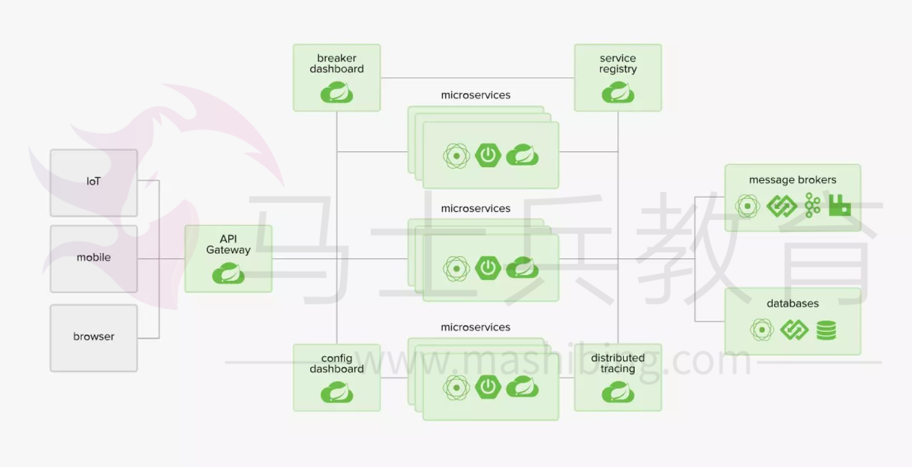
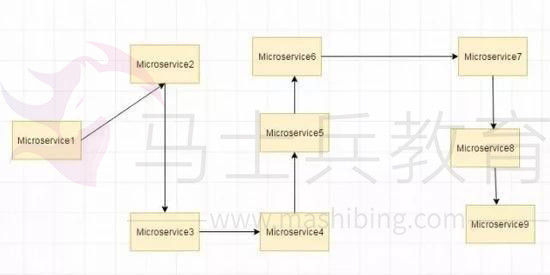
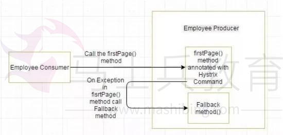
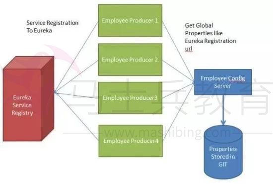
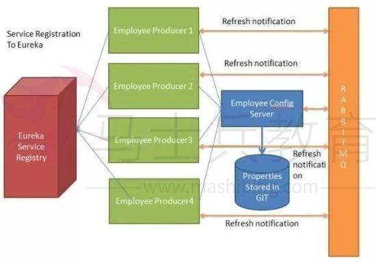

# 为什么需要学习Spring Cloud

不论是商业应用还是用户应用，在业务初期都很简单，我们通常会把它实现为单体结构的应用。但是，随着业务逐渐发展，产品思想会变得越来越复杂，单体结构的应用也会越来越复杂。这就会给应用带来如下的几个问题：

 代码结构混乱：业务复杂，导致代码量很大，管理会越来越困难。同时，这也会给业务的快速迭代带来巨大挑战；

 开发效率变低：开发人员同时开发一套代码，很难避免代码冲突。开发过程会伴随着不断解决冲突的过程，这会严重的影响开发效率；

 排查解决问题成本高：线上业务发现 bug，修复 bug 的过程可能很简单。但是，由于只有一套代码，需要重新编译、打包、上线，成本很高。

由于单体结构的应用随着系统复杂度的增高，会暴露出各种各样的问题。近些年来，微服务架构逐渐取代了单体架构，且这种趋势将会越来越流行。Spring 

Cloud是目前最常用的微服务开发框架，已经在企业级开发中大量的应用。

# 什么是Spring Cloud

Spring Cloud是一系列框架的有序集合。它利用Spring Boot的开发便利性巧妙地简化了分布式系统基础设施的开发，如服务发现注册、配置中心、智能路由、消息总线、负载均衡、断路器、数据监控等，都可以用Spring Boot的开发风格做到一键启动和部署。Spring Cloud并没有重复制造轮子，它只是将各家公司开发的比较成熟、经得起实际考验的服务框架组合起来，通过Spring Boot风格进行再封装屏蔽掉了复杂的配置和实现原理，最终给开发者留出了一套简单易懂、易部署和易维护的分布式系统开发工具包。

# 设计目标与优缺点

设计目标

协调各个微服务，简化分布式系统开发。

## 优缺点

微服务的框架那么多比如：dubbo、Kubernetes，为什么就要使用Spring 

Cloud的呢？

优点：

-  产出于Spring大家族，Spring在企业级开发框架中无人能敌，来头很大，可以保证后续的更新、完善
-  组件丰富，功能齐全。Spring Cloud 为微服务架构提供了非常完整的支持。例如、配置管理、服务发现、断路器、微服务网关等；
- Spring Cloud 社区活跃度很高，教程很丰富，遇到问题很容易找到解决方案服务拆分粒度更细，耦合度比较低，有利于资源重复利用，有利于提高开发效率可以更精准的制定优化服务方案，提高系统的可维护性减轻团队的成本，可以并行开发，不用关注其他人怎么开发，先关注自己的开发微服务可以是跨平台的，可以用任何一种语言开发适于互联网时代，产品迭代周期更短

缺点：

- 微服务过多，治理成本高，不利于维护系统
-  分布式系统开发的成本高（容错，分布式事务等）对团队挑战大总的来说优点大过于缺点，目前看来Spring Cloud是一套非常完善的分布式框架，目前很多企业开始用微服务、Spring Cloud的优势是显而易见的。因此对于想研究微服务架构的同学来说，学习Spring Cloud是一个不错的选择。

# Spring Cloud发展前景

Spring Cloud对于中小型互联网公司来说是一种福音，因为这类公司往往没有实力或者没有足够的资金投入去开发自己的分布式系统基础设施，使用Spring 

Cloud一站式解决方案能在从容应对业务发展的同时大大减少开发成本。同时，随着近几年微服务架构和Docker容器概念的火爆，也会让Spring Cloud在未来越来越“云”化的软件开发风格中立有一席之地，尤其是在五花八门的分布式解决方案中提供了标准化的、全站式的技术方案，意义可能会堪比当年Servlet规范的诞生，有效推进服务端软件系统技术水平的进步。

# 整体架构



# 主要项目

Spring Cloud的子项目，大致可分成两类，一类是对现有成熟框架"Spring 

Boot化"的封装和抽象，也是数量最多的项目；第二类是开发了一部分分布式系统的基础设施的实现，如Spring Cloud Stream扮演的就是kafka, ActiveMQ这样的角色。

## Spring Cloud Config

集中配置管理工具，分布式系统中统一的外部配置管理，默认使用Git来存储配置，可以支持客户端配置的刷新及加密、解密操作。

## Spring Cloud Netflix

Netflix OSS 开源组件集成，包括Eureka、Hystrix、Ribbon、Feign、Zuul等核心组件。

Eureka：服务治理组件，包括服务端的注册中心和客户端的服务发现机制；

Ribbon：负载均衡的服务调用组件，具有多种负载均衡调用策略；

Hystrix：服务容错组件，实现了断路器模式，为依赖服务的出错和延迟提供了容错能力；

Feign：基于Ribbon和Hystrix的声明式服务调用组件；

Zuul：API网关组件，对请求提供路由及过滤功能。

## Spring Cloud Bus

用于传播集群状态变化的消息总线，使用轻量级消息代理链接分布式系统中的节点，可以用来动态刷新集群中的服务配置。

Spring Cloud Consul

基于Hashicorp Consul的服务治理组件。

Spring Cloud Security

安全工具包，对Zuul代理中的负载均衡OAuth2客户端及登录认证进行支持。

## Spring Cloud Sleuth

Spring Cloud应用程序的分布式请求链路跟踪，支持使用Zipkin、HTrace和基于日志（例如ELK）的跟踪。

## Spring Cloud Stream

轻量级事件驱动微服务框架，可以使用简单的声明式模型来发送及接收消息，主要实现为Apache Kafka及RabbitMQ。

## Spring Cloud Task

用于快速构建短暂、有限数据处理任务的微服务框架，用于向应用中添加功能性和非功能性的特性。

Spring Cloud Zookeeper

基于Apache Zookeeper的服务治理组件。

Spring Cloud Gateway

API网关组件，对请求提供路由及过滤功能。

## Spring Cloud OpenFeign

基于Ribbon和Hystrix的声明式服务调用组件，可以动态创建基于Spring MVC 注解的接口实现用于服务调用，在Spring Cloud 2.0中已经取代Feign成为了一等公民。

# Spring Cloud的版本关系

Spring Cloud是一个由许多子项目组成的综合项目，各子项目有不同的发布节奏。 为了管理Spring Cloud与各子项目的版本依赖关系，发布了一个清单，其中包括了某个Spring Cloud版本对应的子项目版本。 为了避免Spring Cloud版本号与子项目版本号混淆，Spring Cloud版本采用了名称而非版本号的命名，

这些版本的名字采用了伦敦地铁站的名字，根据字母表的顺序来对应版本时间顺序，例如Angel是第一个版本，Brixton是第二个版本。 当Spring Cloud的发布

内容积累到临界点或者一个重大BUG被解决后，会发布一个"service 

releases"版本，简称SRX版本，比如Greenwich.SR2就是Spring Cloud发布的 Greenwich版本的第2个SRX版本。目前Spring Cloud的最新版本是Hoxton。

## Spring Cloud和SpringBoot版本对应关系

| Spring Cloud   Version | SpringBo  ot   Version |
| ---------------------- | ---------------------- |
| Hoxton                 | 2.2.x                  |
| Greenwic h             | 2.1.x                  |
| Finchley               | 2.0.x                  |
| Edgware                | 1.5.x                  |
| Dalston                | 1.5.x                  |

## Spring Cloud和各子项目版本对应关系

| More Actions  Compon  ent   | Edgware.  SR6     | Greenwic  h.SR2 |
| --------------------------- | ----------------- | --------------- |
| spring- cloud- bus          | 1.3.4.RELE  ASE   | 2.1.2.RELE  ASE |
| spring- cloud-  commons     | 1.3.6.RELE    ASE | 2.1.2.RELE  ASE |
| spring- cloud- config       | 1.4.7.RELE  ASE   | 2.1.3.RELE  ASE |
| spring-  cloud-     netflix | 1.4.7.RELE  ASE   | 2.1.2.RELE  ASE |
| spring- cloud- security     | 1.2.4.RELE  ASE   | 2.1.3.RELE  ASE |
| spring- cloud- consul       | 1.3.6.RELE  ASE   | 2.1.2.RELE  ASE |
| spring- cloud- sleuth       | 1.3.6.RELE  ASE   | 2.1.1.RELE  ASE |
| spring- cloud- stream       | Ditmars.S  R5     | Fishtown.  SR3  |
| spring- cloud- zookeepe r   | 1.2.3.RELE  ASE   | 2.1.2.RELE  ASE |
| spring-  boot               | 1.5.21.REL  EASE  | 2.1.5.RELE  ASE |
| spring- cloud- task         | 1.2.4.RELE  ASE   | 2.1.2.RELE  ASE |
| spring- cloud- gateway      | 1.0.3.RELE  ASE   | 2.1.2.RELE  ASE |
| spring- cloud- openfeig n   | 暂无              | 2.1.2.RELE  ASE |

注意：Hoxton版本是基于SpringBoot 2.2.x版本构建的，不适用于1.5.x版本。随着2019年8月SpringBoot 1.5.x版本停止维护，Edgware版本也将停止维护。

# SpringBoot和SpringCloud的区别？

SpringBoot专注于快速方便的开发单个个体微服务。

SpringCloud是关注全局的微服务协调整理治理框架，它将SpringBoot开发的一个个单体微服务整合并管理起来，为各个微服务之间提供，配置管理、服务发现、断路器、路由、微代理、事件总线、全局锁、决策竞选、分布式会话等等集成服务

SpringBoot可以离开SpringCloud独立使用开发项目， 但是SpringCloud离不开SpringBoot ，属于依赖的关系

SpringBoot专注于快速、方便的开发单个微服务个体，SpringCloud关注全局的服务治理框架。

## 使用 Spring Boot 开发分布式微服务时，我们面临以下问题

（1）  与分布式系统相关的复杂性-这种开销包括网络问题，延迟开销，带宽问题，安全问题。

（2）  服务发现-服务发现工具管理群集中的流程和服务如何查找和互相交谈。它涉及一个服务目录，在该目录中注册服务，然后能够查找并连接到该目录中的服务。

（3）  冗余-分布式系统中的冗余问题。

（4）  负载平衡 --负载平衡改善跨多个计算资源的工作负荷，诸如计算机，计算机集群，网络链路，中央处理单元，或磁盘驱动器的分布。

（5）  性能-问题 由于各种运营开销导致的性能问题。

（6）部署复杂性-Devops 技能的要求。

# 服务注册和发现是什么意思？Spring Cloud 如何实现？

当我们开始一个项目时，我们通常在属性文件中进行所有的配置。随着越来越多的服务开发和部署，添加和修改这些属性变得更加复杂。有些服务可能会下降，而某些位置可能会发生变化。手动更改属性可能会产生问题。 Eureka 服务注册和发现可以在这种情况下提供帮助。由于所有服务都在 Eureka 服务器上注册并通过调用 Eureka 服务器完成查找，因此无需处理服务地点的任何更改和处理。

Spring Cloud 和dubbo区别?

（1）服务调用方式 dubbo是RPC springcloud Rest Api 

（2）注册中心,dubbo 是zookeeper springcloud是eureka，也可以是 zookeeper

（3）服务网关,dubbo本身没有实现，只能通过其他第三方技术整合， springcloud有Zuul路由网关，作为路由服务器，进行消费者的请求分

发,springcloud支持断路器，与git完美集成配置文件支持版本控制，事物总线实现配置文件的更新与服务自动装配等等一系列的微服务架构要素。

# 负载平衡的意义什么？

在计算中，负载平衡可以改善跨计算机，计算机集群，网络链接，中央处理单元或磁盘驱动器等多种计算资源的工作负载分布。负载平衡旨在优化资源使用，最大化吞吐量，最小化响应时间并避免任何单一资源的过载。使用多个组件进行负载平衡而不是单个组件可能会通过冗余来提高可靠性和可用性。负载平衡通常涉及专用软件或硬件，例如多层交换机或域名系统服务器进程。

# 什么是 Hystrix？它如何实现容错？

Hystrix 是一个延迟和容错库，旨在隔离远程系统，服务和第三方库的访问点，当出现故障是不可避免的故障时，停止级联故障并在复杂的分布式系统中实现弹性。

通常对于使用微服务架构开发的系统，涉及到许多微服务。这些微服务彼此协作。

思考以下微服务



假设如果上图中的微服务 9 失败了，那么使用传统方法我们将传播一个异常。

但这仍然会导致整个系统崩溃。

随着微服务数量的增加，这个问题变得更加复杂。微服务的数量可以高达 1000.

这是 hystrix 出现的地方 我们将使用 Hystrix 在这种情况下的 Fallback 方法功

能。我们有两个服务 employee-consumer 使用由 employee-consumer 公开的服务。

简化图如下所示


现在假设由于某种原因，employee-producer 公开的服务会抛出异常。我们在这种情况下使用 Hystrix 定义了一个回退方法。这种后备方法应该具有与公开服

务相同的返回类型。如果暴露服务中出现异常，则回退方法将返回一些值。

# 什么是 Hystrix 断路器？我们需要它吗？

由于某些原因，employee-consumer 公开服务会引发异常。在这种情况下使用Hystrix 我们定义了一个回退方法。如果在公开服务中发生异常，则回退方法返回一些默认值。



如果 firstPage method() 中的异常继续发生，则 Hystrix 电路将中断，并且员

工使用者将一起跳过 firtsPage 方法，并直接调用回退方法。 断路器的目的是给第一页方法或第一页方法可能调用的其他方法留出时间，并导致异常恢复。可能发生的情况是，在负载较小的情况下，导致异常的问题有更好的恢复机会 。

## 什么是 Netflix Feign？它的优点是什么？

Feign 是受到 Retrofit，JAXRS-2.0 和 WebSocket 启发的 java 客户端联编程序。

Feign 的第一个目标是将约束分母的复杂性统一到 http apis，而不考虑其稳定性。

在 employee-consumer 的例子中，我们使用了 employee-producer 使用 REST模板公开的 REST 服务。

但是我们必须编写大量代码才能执行以下步骤（1）使用功能区进行负载平衡。

（2）  获取服务实例，然后获取基本 URL。

（3）  利用 REST 模板来使用服务。 前面的代码如下

```
1  @Controller
2  public class ConsumerControllerClient {
3  @Autowired
4  private LoadBalancerClient loadBalancer;
5  public void getEmployee() throws RestClientException, IOException {
6   ServiceInstance serviceInstance=loadBalancer.choose("employee‐ producer");
7   System.out.println(serviceInstance.getUri());
8   String baseUrl=serviceInstance.getUri().toString();
9   baseUrl=baseUrl+"/employee";
10   RestTemplate restTemplate = new RestTemplate();
11   ResponseEntity<String> response=null;
12   try{
13   response=restTemplate.exchange(baseUrl,
14   HttpMethod.GET, getHeaders(),String.class);
15   }
16   catch (Exception ex)
17   {
18   System.out.println(ex);
19   }
20   System.out.println(response.getBody());
21  }
```

之前的代码，有像 NullPointer 这样的例外的机会，并不是最优的。我们将看到如何使用 Netflix Feign 使呼叫变得更加轻松和清洁。如果 Netflix Ribbon 依赖关系也在类路径中，那么 Feign 默认也会负责负载平衡。

## 什么是 Spring Cloud Bus？我们需要它吗？

考虑以下情况：我们有多个应用程序使用 Spring Cloud Config 读取属性，而

Spring Cloud Config 从 GIT 读取这些属性。

下面的例子中多个员工生产者模块从 Employee Config Module 获取 Eureka 注册的财产。



如果假设 GIT 中的 Eureka 注册属性更改(img)为指向另一台 Eureka 服务器，会发生什么情况。在这种情况下，我们将不得不重新启动服务以获取更新的属性。还有另一种使用执行器端点/刷新的方式。但是我们将不得不为每个模块单独调

用这个 url。例如，如果 Employee Producer1 部署在端口 8080 上，则调用 http：// localhost：8080 / refresh。同样对于 Employee Producer2 

http：//localhost：8081 / refresh 等等。这又很麻烦。这就是 Spring Cloud Bus 发挥作用的地方。



Spring Cloud Bus 提供了跨多个实例刷新配置的功能。因此，在上面的示例中，如果我们刷新 Employee Producer1，则会自动刷新所有其他必需的模

块。如果我们有多个微服务启动并运行，这特别有用。这是通过将所有微服务连接到单个消息代理来实现的。无论何时刷新实例，此事件都会订阅到侦听此代理的所有微服务，并且它们也会刷新。可以通过使用端点/总线/刷新来实现对任何单个实例的刷新。

# Spring Cloud断路器的作用

当一个服务调用另一个服务由于网络原因或自身原因出现问题，调用者就会等待被调用者的响应 当更多的服务请求到这些资源导致更多的请求等待，发生连锁效应（雪崩效应）断路器有完全打开状态:一段时间内 达到一定的次数无法调用 并且多次监测没有恢复的迹象 断路器完全打开 那么下次请求就不会请求到该服务半开:短时间内 有恢复迹象 断路器会将部分请求发给该服务，正常调用时 断路器关闭

关闭：当服务一直处于正常状态 能正常调用

## 什么是Spring Cloud Config?

在分布式系统中，由于服务数量巨多，为了方便服务配置文件统一管理，实时更新，所以需要分布式配置中心组件。在Spring Cloud中，有分布式配置中心组件spring cloud config ，它支持配置服务放在配置服务的内存中（即本地），也支持放在远程Git仓库中。在spring cloud config 组件中，分两个角色，一是 config server，二是config client。

使用：

（1）  添加pom依赖

（2）  配置文件添加相关配置

（3）  启动类添加注解@EnableConfigServer

## 什么是Spring Cloud Gateway?

Spring Cloud Gateway是Spring Cloud官方推出的第二代网关框架，取代Zuul 网关。网关作为流量的，在微服务系统中有着非常作用，网关常见的功能有路由转发、权限校验、限流控制等作用。

使用了一个RouteLocatorBuilder的bean去创建路由，除了创建路由

RouteLocatorBuilder可以让你添加各种predicates和filters，predicates断言的意思，顾名思义就是根据具体的请求的规则，由具体的route去处理，filters 是各种过滤器，用来对请求做各种判断和修改。


## 分布式事务解决方案([三种案例](https://blog.csdn.net/woaitingting1985/article/details/115165415)) -必会
- 方案一：两阶段提交协议2PC：prepare、commit/rollback

    案例：[整合 Atomikos +mysql+mybatis+tomcat/jetty](https://mp.weixin.qq.com/s/maBgfIX7daJl2Pi0QASw9A)

- 方案二：事务补偿（TCC）：try、commit、cancel（注意处理接口幂等问题）
  
- 方案三：消息队列实现最终一致：将分布式事务拆分成多个本地事务来完成，并且由消息队列异步协调完成