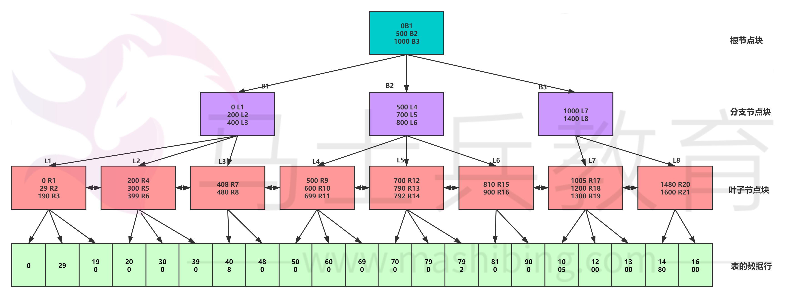
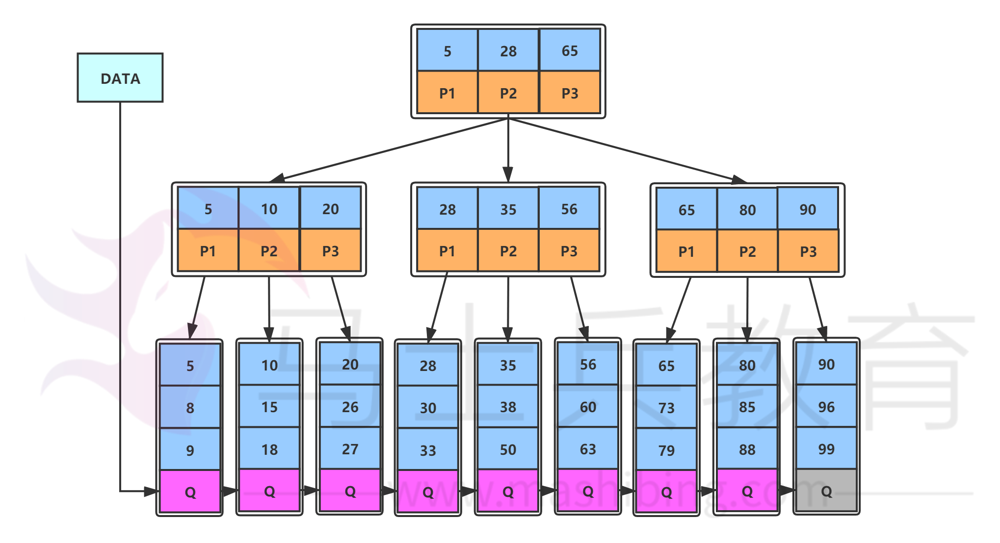
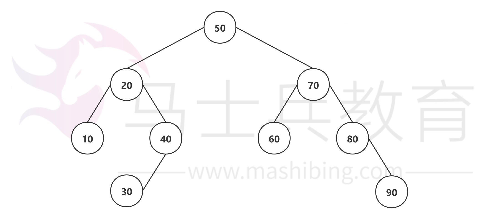
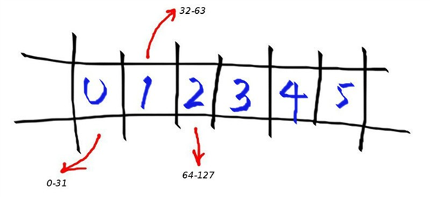
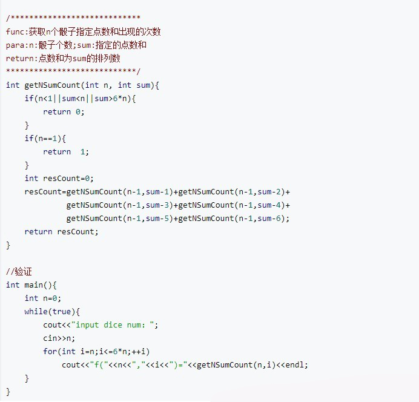
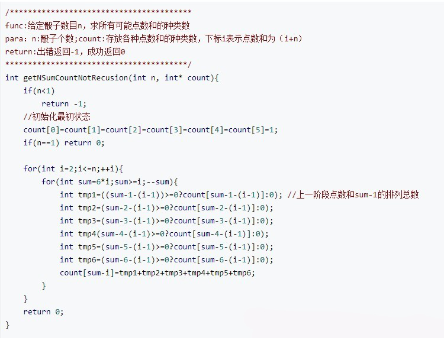

# （1） 红黑树的了解（平衡树，二叉搜索树），使用场景

把数据结构上几种树集中的讨论一下：

## 1. AVLtree 

定义：先发明的自平衡二叉查找树。在AVL树中任何节点的两个子树的高度 大差别为一，所以它也被称为高度平衡树。查找、插入和删除在平均和坏情况 下都是O（log n）。增加和删除可能需要通过一次或多次树旋转来重新平衡这 个树。 

节点的平衡因子是它的左子树的高度减去它的右子树的高度（有时相反）。带有 平衡因子1、0或 -1的节点被认为是平衡的。带有平衡因子 -2或2的节点被认为 是不平衡的，并需要重新平衡这个树。平衡因子可以直接存储在每个节点中，或 从可能存储在节点中的子树高度计算出来。

一般我们所看见的都是排序平衡二叉树。 

AVLtree使用场景：AVL树适合用于插入删除次数比较少，但查找多的情况。插 入删除导致很多的旋转，旋转是非常耗时的。AVL 在linux内核的vm area中使用。 

## 2. 二叉搜索树 

二叉搜索树也是一种树，适用与一般二叉树的全部操作，但二叉搜索树能够实现 数据的快速查找。

二叉搜索树满足的条件： 

1. 非空左子树的所有键值小于其根节点的键值 
2. 非空右子树的所有键值大于其根节点的键值 
3. 左右子树都是二叉搜索树 

二叉搜索树的应用场景：如果是没有退化称为链表的二叉树，查找效率就是 lgn，效率不错，但是一旦退换称为链表了，要么使用平衡二叉树，或者之后的 RB树，因为链表就是线性的查找效率。 

## 3. 红黑树的定义

红黑树是一种二叉查找树，但在每个结点上增加了一个存储位表示结点的颜色， 可以是RED或者BLACK。通过对任何一条从根到叶子的路径上各个着色方式的 限制，红黑树确保没有一条路径会比其他路径长出两倍，因而是接近平衡的。 当二叉查找树的高度较低时，这些操作执行的比较快，但是当树的高度较高时， 这些操作的性能可能不比用链表好。红黑树（red-black tree）是一种平衡的二 叉查找树，它能保证在坏情况下，基本的动态操作集合运行时间为O(lgn)。 红黑树必须要满足的五条性质： 

- 性质一：节点是红色或者是黑色； 在树里面的节点不是红色的就是黑色的，没有其他 颜色，要不怎么叫红黑树呢，是吧。 
- 性质二：根节点是黑色； 根节点总是黑色的。它不能为红。 
- 性质三：每个叶节点（NIL或空节点）是黑色；
- 性质四：每个红色节点的两个子节点都是黑色的（也就是说不存在两个连续的红色节 点）； 就是连续的两个节点不能是连续的红色，连续的两个节点的意思就是父节点与 子节点不能是连续的红色。 
- 性质五：从任一节点到其每个叶节点的所有路径都包含相同数目的黑色节点。从根节点 到每一个NIL节点的路径中，都包含了相同数量的黑色节点。 

红黑树的应用场景：红黑树是一种不是非常严格的平衡二叉树，没有AVLtree那 么严格的平衡要求，所以它的平均查找，增添删除效率都还不错。广泛用在 C++的STL中。如map和set都是用红黑树实现的。 

## 4. B树定义 

B树和平衡二叉树稍有不同的是B树属于多叉树又名平衡多路查找树（查找路径 不只两个），不属于二叉搜索树的范畴，因为它不止两路，存在多路。 

B树满足的条件： 

- （1）树种的每个节点多拥有m个子节点且m>=2,空树除外（注：m阶代表一个树节 点多有多少个查找路径，m阶=m路,当m=2则是2叉树,m=3则是3叉）； 
- （2）除根节点外每个节点的关键字数量大于等于ceil(m/2)-1个小于等于m-1个，非根 节点关键字数必须>=2;（注：ceil()是个朝正无穷方向取整的函数 如ceil(1.1)结果为2) 
- （3）所有叶子节点均在同一层、叶子节点除了包含了关键字和关键字记录的指针外也 有指向其子节点的指针只不过其指针地址都为null对应下图后一层节点的空格子 
- （4）如果一个非叶节点有N个子节点，则该节点的关键字数等于N-1; 
- （5）所有节点关键字是按递增次序排列，并遵循左小右大原则；



 B树的应用场景：构造一个多阶的B类树，然后在尽量多的在结点上存储相关的信息， 保证层数尽量的少，以便后面我们可以更快的找到信息，磁盘的I/O操作也少一些，而 且B类树是平衡树，每个结点到叶子结点的高度都是相同，这也保证了每个查询是稳定 的。 

## 5. B+树 

B+树是B树的一个升级版，B+树是B树的变种树，有n棵子树的节点中含有n个 关键字，每个关键字不保存数据，只用来索引，数据都保存在叶子节点。是为文 件系统而生的。 

相对于B树来说B+树更充分的利用了节点的空间，让查询速度更加稳定，其速度 完全接近于二分法查找。为什么说B+树查找的效率要比B树更高、更稳定；我们 先看看两者的区别 

- （1）B+跟B树不同，B+树的非叶子节点不保存关键字记录的指针，这样使得B+树每 个节点所能保存的关键字大大增加； 
- （2）B+树叶子节点保存了父节点的所有关键字和关键字记录的指针，每个叶子节点的 关键字从小到大链接； 
- （3）B+树的根节点关键字数量和其子节点个数相等; 
- （4）B+的非叶子节点只进行数据索引，不会存实际的关键字记录的指针，所有数据地 址必须要到叶子节点才能获取到，所以每次数据查询的次数都一样；



特点： 

在B树的基础上每个节点存储的关键字数更多，树的层级更少所以查询数据更 快，所有指关键字指针都存在叶子节点，所以每次查找的次数都相同所以查询速 度更稳定; 

应用场景： 用在磁盘文件组织 数据索引和数据库索引。 

## 6. Trie树（字典树） 

trie，又称前缀树，是一种有序树，用于保存关联数组，其中的键通常是字符 串。与二叉查找树不同，键不是直接保存在节点中，而是由节点在树中的位置决 定。一个节点的所有子孙都有相同的前缀，也就是这个节点对应的字符串，而根 节点对应空字符串。一般情况下，不是所有的节点都有对应的值，只有叶子节点 和部分内部节点所对应的键才有相关的值。 

在图示中，键标注在节点中，值标注在节点之下。每一个完整的英文单词对应一 个特定的整数。Trie 可以看作是一个确定有限状态自动机，尽管边上的符号一 般是隐含在分支的顺序中的。 

键不需要被显式地保存在节点中。图示中标注出完整的单词，只是为了演示 trie  的原理。

.png)

trie树的优点：利用字符串的公共前缀来节约存储空间，大限度地减少无谓的 字符串比较，查询效率比哈希表高。

缺点：Trie树是一种比较简单的数据结构.理 解起来比较简单,正所谓简单的东西也得付出代价.故Trie树也有它的缺点,Trie树 的内存消耗非常大. 

其基本性质可以归纳为： 

1. 根节点不包含字符，除根节点外每一个节点都只包含一个字符。 
2. 从根节点到某一节点，路径上经过的字符连接起来，为该节点对应的字符串。 
3. 每个节点的所有子节点包含的字符都不相同。 

典型应用是用于统计，排序和保存大量的字符串（但不仅限于字符串），所以经 常被搜索引擎系统用于文本词频统计。字典树与字典很相似,当你要查一个单词 是不是在字典树中,首先看单词的第一个字母是不是在字典的第一层,如果不在,说 明字典树里没有该单词,如果在就在该字母的孩子节点里找是不是有单词的第二 个字母,没有说明没有该单词,有的话用同样的方法继续查找.字典树不仅可以用来 储存字母,也可以储存数字等其它数据。 

# （2） 红黑树在STL上的应用

STL中set、multiset、map、multimap底层是红黑树实现的，而 unordered_map、unordered_set 底层是哈希表实现的。 

multiset、multimap： 插入相同的key的时候，我们将后插入的key放在相等的 key的右边，之后不管怎么进行插入或删除操作，后加入的key始终被认为比之 前的大。 

## 8. （3）了解并查集吗？（低频）

什么是合并查找问题呢？

顾名思义，就是既有合并又有查找操作的问题。举个例子，有一群人，他们之间 有若干好友关系。如果两个人有直接或者间接好友关系，那么我们就说他们在同 一个朋友圈中，这里解释下，如果Alice是Bob好友的好友，或者好友的好友的 好友等等，即通过若干好友可以认识，那么我们说Alice和Bob是间接好友。随 着时间的变化，这群人中有可能会有新的朋友关系，这时候我们会对当中某些人 是否在同一朋友圈进行询问。这就是一个典型的合并－查找操作问题，既包含了 合并操作，又包含了查找操作。 

并查集，在一些有N个元素的集合应用问题中，我们通常是在开始时让每个元素 构成一个单元素的集合，然后按一定顺序将属于同一组的元素所在的集合合并， 其间要反复查找一个元素在哪个集合中。 

并查集是一种树型的数据结构，用于处理一些不相交集合（Disjoint Sets）的合 并及查询问题。 

并查集也是使用树形结构实现。不过，不是二叉树。每个元素对应一个节点，每 个组对应一棵树。在并查集中，哪个节点是哪个节点的父亲以及树的形状等信息 无需多加关注，整体组成一个树形结构才是重要的。类似森林 

# （4） 贪心算法和动态规划的区别

贪心算法：局部优，划分的每个子问题都优，得到全局优，但是不能保证 是全局优解，所以对于贪心算法来说，解是从上到下的，一步一步优，直到 后。 动态规划：将问题分解成重复的子问题，每次都寻找左右子问题解中优的解， 一步步得到全局的优解.重复的子问题可以通过记录的方式，避免多次计算。 所以对于动态规划来说，解是从小到上，从底层所有可能性中找到优解，再一 步步向上。 分治法：和动态规划类似，将大问题分解成小问题，但是这些小问题是独立的， 没有重复的问题。独立问题取得解，再合并成大问题的解。 例子：比如钱币分为1元3元4元，要拿6元钱，贪心的话，先拿4，再拿两个1， 一共3张钱；实际优却是两张3元就够了。 

## （5） 判断一个链表是否有环，如何找到这个环的起点

给定一个单链表，只给出头指针h： 

1. 如何判断是否存在环？ 
2. 如何知道环的长度？ 
3. 如何找出环的连接点在哪里？ 
4. 带环链表的长度是多少？ 

解法： 

1. 对于问题1，使用追赶的方法，设定两个指针slow、fast，从头指针开始， 每次分别前进1步、2步。如存在环，则两者相遇；如不存在环，fast遇到NULL 退出。 
2. 对于问题2，记录下问题1的碰撞点p，slow、fast从该点开始，再次碰撞所 走过的操作数就是环的长度s。 
3. 问题3：有定理：碰撞点p到连接点的距离=头指针到连接点的距离，因此， 分别从碰撞点、头指针开始走，相遇的那个点就是连接点。(证明在后面附注) 
4. 问题3中已经求出连接点距离头指针的长度，加上问题2中求出的环的长度， 二者之和就是带环单链表的长度

# 6） 实现一个strcpy函数（或者memcpy），如果内存可能重叠呢

——大家一般认为名不见经传strcpy函数实现不是很难，流行的strcpy函数写法是：

```
1. char *my_strcpy(char *dst,const char *src)
2. {
3. assert(dst != NULL);
4. assert(src != NULL);
5. char *ret = dst;
6. while((* dst++ = * src++) != '\0')
7. ;
8. return ret;
9. }
```

如果注意到：

1，检查指针有效性；

2，返回目的指针des；

3，源字符串的末尾 ‘\0’ 需要拷贝。

## 内存重叠

内存重叠：拷贝的目的地址在源地址范围内。所谓内存重叠就是拷贝的目的地址和源地址有重叠。

在函数strcpy和函数memcpy都没有对内存重叠做处理的，使用这两个函数的时候只有程序员自己保证源地址和目标地址不重叠，或者使用memmove函数进行内存拷贝。

memmove函数对内存重叠做了处理。

strcpy的正确实现应为：

```
1. char *my_strcpy(char *dst,const char *src)
2. {
3. assert(dst != NULL);
4. assert(src != NULL);
5. char *ret = dst;
6. memmove(dst,src,strlen(src)+1);
7. return ret;
8. }
```

memmove函数实现时考虑到了内存重叠的情况，可以完成指定大小的内存拷贝

# （7） 快排存在的问题，如何优化

## 快排的时间复杂度

时间复杂度  快平均是O（nlogn）,  慢的时候是O(n2);辅助空间也是

O(logn)；   开始学快排时   疑惑的就是这个东西不知道怎么得来的，一种是通过数学运算可以的出来，还有一种是通过递归树来理解就容易多了



所谓时间复杂度 理想的就是取到中位数情况，那么递归树就是一个完全二叉树，那么树的深度也就是 低为Logn，这个时候每一次又需要n次比较，所以时间复杂度nlogn，当快排为顺序或者逆序

时，这个数为一个斜二叉树，深度为n，同样每次需要n次比较，那那么  坏需要n2的时间优化：

1.当整个序列有序时退出算法；

2.当序列长度很小时（根据经验是大概小于 8），应该使用常数更小的算法，比如插入排序等；

3.随机选取分割位置；

4.当分割位置不理想时，考虑是否重新选取分割位置；

5.分割成两个序列时，只对其中一个递归进去，另一个序列仍可以在这一函数内继续划分，可以显著减小栈的大小（尾递归）：

6.将单向扫描改成双向扫描，可以减少划分过程中的交换次数优化1：当待排序序列的长度分割到一定大小后，使用插入排序原因：对于很小和部分有序的数组，快排不如插排好。当待排序序列的长度分割到一定大小后，继续分割的效率比插入排序要差，此时可以使用插排而不是快排优化2：在一次分割结束后，可以把与Key相等的元素聚在一起，继续下次分割时，不用再对与key相等元素分割优化3：优化递归操作快排函数在函数尾部有两次递归操作，我们可以对其使用尾递归优化优点：如果待排序的序列划分极端不平衡，递归的深度将趋近于n，而栈的大小是很有限的，每次递归调用都会耗费一定的栈空间，函数的参数越多，每次递归

耗费的空间也越多。优化后，可以缩减堆栈深度，由原来的O(n)缩减为

O(logn)，将会提高性能。

# （8） Top K问题（可以采取的方法有哪些，各自优点？）

1.将输入内容（假设用数组存放）进行完全排序，从中选出排在前K的元素即为所求。有了这个思路，我们可以选择相应的排序算法进行处理，目前来看快速排序，堆排序和归并排序都能达到O(nlogn)的时间复杂度。

2.对输入内容进行部分排序，即只对前K大的元素进行排序（这K个元素即为所求）。此时我们可以选择冒泡排序或选择排序进行处理，即每次冒泡（选择）都能找到所求的一个元素。这类策略的时间复杂度是O(Kn)。

3.对输入内容不进行排序，显而易见，这种策略将会有更好的性能开销。我们此时可以选择两种策略进行处理：用一个桶来装前k个数，桶里面可以按照 小堆来维护 a)利用 小堆维护一个大小为K的数组，目前该小根堆中的元素是排名前K的数，其中根是 小的数。此后，每次从原数组中取一个元素与根进行比较，如大于根的元素，则将根元素替换并进行堆调整（下沉），即保证小根堆中的元素仍然是排名前K的数，且根元素仍然 小；否则不予处理，取下一个数组元素继续该过程。该算法的时间复杂度是O(nlogK)，一般来说企业中都采用该策略处理 top-K问题，因为该算法不需要一次将原数组中的内容全部加载到内存中，而这正是海量数据处理必然会面临的一个关卡。

b)利用快速排序的分划函数找到分划位置K，则其前面的内容即为所求。该算法是一种非常有效的处理方式，时间复杂度是O(n)（证明可以参考算法导论书籍）。对于能一次加载到内存中的数组，该策略非常优秀。

# （9） Bitmap的使用，存储和插入方法

## BitMap从字面的意思

很多人认为是位图，其实准确的来说，翻译成基于位的映射。

在所有具有性能优化的数据结构中，大家使用  多的就是hash表，是的，在具有定位查找上具有O(1)的常量时间，多么的简洁优美。但是数据量大了，内存就不够了。

当然也可以使用类似外排序来解决问题的，由于要走IO所以时间上又不行。

所谓的Bit-map就是用一个bit位来标记某个元素对应的Value， 而Key即是该元素。由于采用了Bit为单位来存储数据，因此在存储空间方面，可以大大节省。

其实如果你知道计数排序的话（算法导论中有一节讲过），你就会发现这个和计数排序很像。

## bitmap应用

```
1）可进行数据的快速查找，判重，删除，一般来说数据范围是int的10倍以下。
2）去重数据而达到压缩数据
```

还可以用于爬虫系统中url去重、解决全组合问题。

BitMap应用：排序示例

假设我们要对0-7内的5个元素(4,7,2,5,3)排序（这里假设这些元素没有重复）。那么我们就可以采用Bit-map的方法来达到排序的目的。要表示8个数，我们就只需要8个Bit（1Bytes），首先我们开辟1Byte的空间，将这些空间的所有Bit位都置为0(如下图：)


然后遍历这5个元素，首先第一个元素是4，那么就把4对应的位置为1（可以这样操作 p+(i/8)|(0×01<<(i%8)) 当然了这里的操作涉及到Big-ending和Littleending的情况，这里默认为Big-ending。不过计算机一般是小端存储的，如

intel。小端的话就是将倒数第5位置1）,因为是从零开始的，所以要把第五位置为一（如下图）：


然后再处理第二个元素7，将第八位置为1,，接着再处理第三个元素，一直到后处理完所有的元素，将相应的位置为1，这时候的内存的Bit位的状态如下：


然后我们现在遍历一遍Bit区域，将该位是一的位的编号输出（2，3，4，5，7），这样就达到了排序的目的。

## bitmap排序复杂度分析

Bitmap排序需要的时间复杂度和空间复杂度依赖于数据中  大的数字。

bitmap排序的时间复杂度不是O(N)的，而是取决于待排序数组中的大值

MAX，在实际应用上关系也不大，比如我开10个线程去读byte数组，那么复杂度为:O(Max/10)。也就是要是读取的，可以用多线程的方式去读取。时间复杂度方面也是O(Max/n)，其中Max为byte[]数组的大小，n为线程大小。空间复杂度应该就是O(Max/8)bytes吧

## BitMap算法流程

假设需要排序或者查找的 大数MAX=10000000（lz:这里MAX应该是 大的数而不是int数据的总数！），那么我们需要申请内存空间的大小为int a[1 + 

MAX/32]。

其中：a[0]在内存中占32为可以对应十进制数0-31，依次类推： bitmap表为：

a[0]--------->0-31 a[1]--------->32-63 a[2]--------->64-95

a[3]--------->96-127



我们要把一个整数N映射到Bit-Map中去，首先要确定把这个N Mapping到哪一个数组元素中去，即确定映射元素的index。我们用int类型的数组作为map的元素，这样我们就知道了一个元素能够表示的数字个数(这里是32)。于是N/32 就可以知道我们需要映射的key了。所以余下来的那个N%32就是要映射到的位数。

1.求十进制数对应在数组a中的下标：

先由十进制数n转换为与32的余可转化为对应在数组a中的下标。

如十进制数0-31，都应该对应在a[0]中，比如n=24,那么 n/32=0，则24对应在数组a中的下标为0。又比如n=60,那么n/32=1，则60对应在数组a中的下标为 1，同理可以计算0-N在数组a中的下标。

i = N>>K % 结果就是N/(2^K)

Note: map的范围是[0, 原数组 大的数对应的2的整次方数-1]。

2.求十进制数对应数组元素a[i]在0-31中的位m：

十进制数0-31就对应0-31，而32-63则对应也是0-31，即给定一个数n可以通过模32求得对应0-31中的数。

m = n & ((1 << K) - 1) %结果就是n%(2^K)

3.利用移位0-31使得对应第m个bit位为1

如a[i]的第m位置1：a[i] = a[i] | (1<

如：将当前4对应的bit位置1的话，只需要1左移4位与B[0] | 即可。

Note:

1 p+(i/8)|(0×01<<(i%8))这样也可以？

2 同理将int型变量a的第k位清0，即a=a&~(1<

## BitMap算法评价

优点：

1. 运算效率高，不进行比较和移位；

2. 占用内存少，比如   大的数MAX=10000000；只需占用内存为

MAX/8=1250000Byte=1.25M。

3.

缺点：

1. 所有的数据不能重复，即不可对重复的数据进行排序。（少量重复数据查找还是可以的，用2-bitmap）。

2.  当数据类似（1，1000，10万）只有3个数据的时候，用bitmap时间复杂度和空间复杂度相当大，只有当数据比较密集时才有优势。

# （10） 字典树的理解以及在统计上的应用

Trie的核心思想是空间换时间。利用字符串的公共前缀来降低查询时间的开销以达到提高效率的目的。Trie树也有它的缺点,Trie树的内存消耗非常大.当然,或许用左儿子右兄弟的方法建树的话,可能会好点. 就是在海量数据中找出某一个数，比如2亿QQ号中查找出某一个特定的QQ号

# （11） N个骰子出现和为m的概率

典型的可以用动态规划的思想来完成

1.现在变量有：骰子个数，点数和。当有k个骰子，点数和为n时，出现次数记为 f(k,n)。那与k-1个骰子阶段之间的关系是怎样的？

2.当我有k-1个骰子时，再增加一个骰子，这个骰子的点数只可能为1、2、3、

4、5或6。那k个骰子得到点数和为n的情况有：

(k-1,n-1)：第k个骰子投了点数1

(k-1,n-2)：第k个骰子投了点数2

(k-1,n-3)：第k个骰子投了点数3

…

(k-1,n-6)：第k个骰子投了点数6

在k-1个骰子的基础上，再增加一个骰子出现点数和为n的结果只有这6种情况！所以：f(k,n)=f(k-1,n-1)+f(k-1,n-2)+f(k-1,n-3)+f(k-1,n-4)+f(k-1,n-5)+f(k-

1,n-6)

3.有1个骰子，f(1,1)=f(1,2)=f(1,3)=f(1,4)=f(1,5)=f(1,6)=1。

用递归就可以解决这个问题：



用迭代来完成



# （19） 海量数据问题（可参考左神的书）

目前关于海量数据想到的解决办法：

1.bitmap

2.桶排序，外部排序，将需要排序的放到外存上，不用全部放到内存上

# （20） 一致性哈希说明

优点

1.当后端是缓存服务器时，经常使用一致性哈希算法来进行负载均衡。使用一致性哈希的好处在于，增减集群的缓存服务器时，只有少量的缓存会失效，回源量较小。

2.尽量减少数据丢失问题，减少移动数据的风险


## 负载均衡使用的算法
- 轮询法        ：将请求按顺序轮流地分配到后端服务器上
  
- 随机法        ：通过系统的随机算法，根据后端服务器的列表大小值来随机选取其中的一台服务器进行访问
  
- 加权轮训法    ：给配置高、负载低的机器配置更高的权重，让其处理更多的请求
  
- 加权随机法    ：给配置高、负载低的机器配置更高的权重，让其处理更多的请求
  
- 源地址哈希法  ：源地址哈希的思想是根据获取客户端的IP地址，通过哈希函数计算得到的一个数值，用该数值对服务器列表的大小进行取模运算，得到的结果便是客服端要访问服务器的序号。采用源地址哈希法进行负载均衡，同一IP地址的客户端，当后端服务器列表不变时，它每次都会映射到同一台后端服务器进行访问；