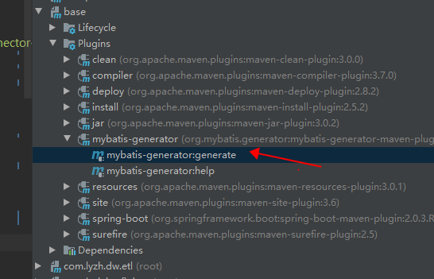

参考网址：https://www.cnblogs.com/liaojie970/p/7058543.html

## 方案一：idea中命令方式：
run --- > 新建maven ---->输入命令 mybatis-generator:generate  -e

## 方案二：idea中功能内 pom引入maven plugin
###  1、mybatis-generator中加入generatorConfig.xml配置
    <?xml version="1.0" encoding="UTF-8"?>
    <!DOCTYPE generatorConfiguration
        PUBLIC "-//mybatis.org//DTD MyBatis Generator Configuration 1.0//EN"
        "http://mybatis.org/dtd/mybatis-generator-config_1_0.dtd">

    <generatorConfiguration>
    <!-- 数据库连接驱动包 -->
    <classPathEntry
            location="F:\UserProgramFiles\.m2\repository\mysql\mysql-connector-java\8.0.12\mysql-connector-java-8.0.12.jar"/>
    <context id="mysqlGen" targetRuntime="MyBatis3Simple">
        <plugin type="org.mybatis.generator.plugins.ToStringPlugin"/>
        <plugin type="org.mybatis.generator.plugins.EqualsHashCodePlugin"/>
        <plugin type="org.mybatis.generator.plugins.SerializablePlugin"/>
        <commentGenerator>
            <property name="javaFileEncoding" value="UTF-8"/>
            <property name="suppressDate" value="false"/>
            <property name="suppressAllComments" value="true"/>
        </commentGenerator>
        <!-- 数据库连接配置 -->
        <jdbcConnection driverClass="com.mysql.cj.jdbc.Driver"
                    connectionURL="jdbc:mysql://192.168.1.10:3306/test"
                    userId="root"
                    password="123456"/>
        <!-- 实体类配置 -->
        <javaModelGenerator targetPackage="com.demo.hw.fl.entity"
                        targetProject="E:\workSpace\online_business\base\src\main\java">
            <property name="enableSubPackages" value="true"/>
            <property name="trimStrings" value="false"/>
            <property name="rootClass" value="com.demo.msa.framework.common.base.BaseEntity"/>
        </javaModelGenerator>
        <!-- Mapping.xml 配置 -->
        <sqlMapGenerator targetPackage="console"
                    targetProject="E:\workSpace\online_business\base\src\main\resources\mybatis\mapper">
            <property name="enableSubPackages" value="true"/>
        </sqlMapGenerator>
        <!-- DAO 接口配置 -->
        <javaClientGenerator targetPackage="com.demo.msa.dao.dao.fl"
                        targetProject="E:\workSpace\online_business\dao\src\main\java"
                        type="XMLMAPPER">
            <property name="enableSubPackages" value="true"/>
            <property name="rootInterface" value="com.demo.msa.dao.base.dao.BaseDAO"/>
        </javaClientGenerator>
        <!-- 表名配置, 多个实体类复制多份配置 -->
        <table tableName="h_demo_analysis"
                domainObjectName="DemoAnalysis"
                mapperName="DemoAnalysisDAO"
                enableCountByExample="false"
                enableUpdateByExample="false"
                enableDeleteByExample="false"
                enableSelectByExample="false"
                selectByExampleQueryId="false">
        </table>

    </context>
    </generatorConfiguration>
## 2：pom:
    <plugin>
    <groupId>org.mybatis.generator</groupId>
    <artifactId>mybatis-generator-maven-plugin</artifactId>
    <version>1.3.7</version>
    <configuration>
        <configurationFile>src/main/resources/mybatis-generator/generatorConfig.xml</configurationFile>
        <verbose>true</verbose>
        <overwrite>true</overwrite>
    </configuration>
    <dependencies>
        <dependency>
            <groupId>org.mybatis.generator</groupId>
            <artifactId>mybatis-generator-core</artifactId>
            <version>1.3.7</version>
        </dependency>
    </dependencies>
    </plugin>
## 3:idea右侧maven运行plugin

    mybatis-generator:generate 

